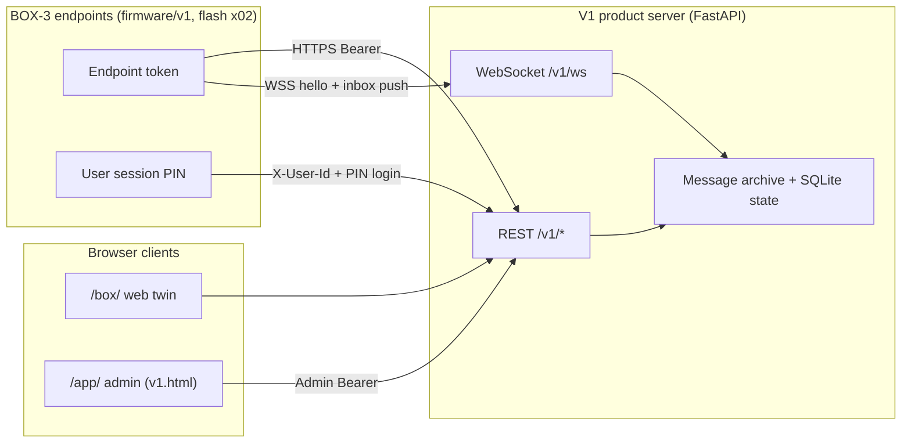

# V1 product architecture overview

High-level map of the **approved v1 product** as implemented in this repository: three BOX-3 **endpoints** (firmware **x02**), one household **server** (`demos/server/v1_product/`), and two browser surfaces (**web twin** `/box/`, **admin** `/app/`).

Normative product contract: [`plans/v1-product-spec.md`](../plans/v1-product-spec.md). Screen copy and timing: [`BOX-UI.md`](../BOX-UI.md). Future long-message protocol: [`MESSAGE-PROTOCOL.md`](../MESSAGE-PROTOCOL.md).

## System diagram

## Responsibilities

| Layer | Owns | Does not own |
|-------|------|----------------|
| **Server** | Hangout registry (YAML), per-user inbox, broadcast fan-out, durable message media, read/position/profile state, admin PIN reset, welcome seed, inbox WebSocket alerts | Device UI, on-device recording, TLS/Tailscale deployment (documented separately) |
| **Firmware (x02)** | Wi-Fi, sign-in roster, PIN pad, carousel UX, record/upload (multipart WAV today), local playback from downloaded blobs, sleep/dim, settings | Server-side persistence, web admin |
| **Web twin (`/box/`)** | Keyboard-driven parity check for carousel, picker, settings, send UX | Hardware mute, real mic capture |
| **Web admin (`/app/v1.html`)** | Lynn login, PIN reset display, welcome WAV, outbound send | Box PIN entry |

## Authentication model

1. **Endpoint** — `Authorization: Bearer <device_token>` on every API call; token maps to an endpoint row in hangout YAML (`demos/server/_shared/hangout_registry.py`).
2. **User session** — After `POST /v1/session/login` with user id + PIN, clients send `X-User-Id` for inbox, send, profile, and playback routes.
3. **Web admin** — Separate `POST /v1/admin/login` (username + web password); short-lived in-memory admin token (not the device token).

## Data flow (async audio)

1. Sender picks recipient(s) on device → records PCM → **multipart** `POST /v1/messages` with WAV blob (firmware today).
2. Server commits media under `message_store/`, updates per-recipient inbox rows, persists read/position in SQLite.
3. Recipients refresh inbox (`GET /v1/inbox`) or receive `inbox` WebSocket event → download `GET /v1/messages/{seq}/blob` → play on glass with position/read sync.

Server also implements **PCM chunk** create/upload/complete per [`MESSAGE-PROTOCOL.md`](../MESSAGE-PROTOCOL.md); firmware does **not** use those routes yet.

## Shared contracts

| Artifact | Role |
|----------|------|
| [`shared/v1/timing.yaml`](../../shared/v1/timing.yaml) | Connect retry, PIN lockout, record caps, sleep — generated to `firmware/v1/v1_timing.h` and `demos/server/v1_product/web/v1_timing.js` |
| `make v1-timing` / `make check-v1-parity` | Regenerate and verify firmware vs web twin timing |

## Run and test entry points

| Target | Purpose |
|--------|---------|
| `make v1-server` | Product host on `0.0.0.0:8080` |
| `make demo-v1` | Smoke script against v1_product module |
| `python -m unittest discover -s demos/server/v1_product/tests -v` | Server + archive regression (21 tests) |
| `make x02` / `make flash DEMO=x02` | Build/flash device firmware |

## Related architecture docs

- [Server](server.md) — routes, storage, processes
- [Clients](client.md) — firmware modules, web twin, admin UI
- [Protocols](protocols.md) — HTTP, WebSocket, media upload shapes
