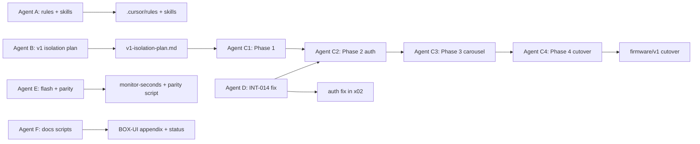

# Stability work delegation — subagent prompts

**Created:** 2026-09-10  
**Source:** [`stability-synthesis.md`](../../stability-synthesis.md) + prior implementation plan  
**Maintainer decisions:** No literal "grill me" section found in repo. Use [`v1-product-spec.md`](v1-product-spec.md) § "Resolved decisions (formerly open)", [`OPEN-QUESTIONS.md`](../../OPEN-QUESTIONS.md) resolved items, and [`BOX-UI.md`](../../BOX-UI.md) as authoritative — do not reopen PIN model, record caps, or parent-client choices.

---

## Work streams

| ID | Agent | Status | Deliverable |
|----|-------|--------|-------------|
| A | Rules + skills | **done** | `.cursor/rules/*.mdc`, `.cursor/skills/*/SKILL.md`, `docs/AGENTS.md` stability section |
| B | V1 isolation planner | **done** | [`v1-isolation-plan.md`](v1-isolation-plan.md) |
| C1 | V1 Phase 1 skeleton | **done** | `shared/v1/`, stubs, `make v1-timing`, wire `box.js` |
| D | INT-014 firmware fix | **done** | `login_generation`, entry-gate fix, structured logging → `v1_auth.c` |
| E | Flash + parity tooling | **done** | `flash.py --monitor-seconds`, `check_v1_parity.py` |
| F | Docs acceptance scripts | **done** | BOX-UI appendix, synthesis §9, delegation C2–C4 prompts |
| C2 | V1 Phase 2 auth+connect | **done** | `v1_auth`, `v1_connect`, `v1_state`, `v1_api`, `v1_ui_common` |
| C3 | V1 Phase 3 carousel+record | **done** | `v1_carousel`, `v1_record`, `x02_main.c`; shim 1 line |
| C4 | V1 Phase 4 cutover | **done** | Docs cutover; DEMO-MAP; AGENTS; synthesis §9 |

**Parallel batches:** Batch 1 (C1+D+E+F) → Batch 2 (C2) → Batch 3 (C3) → Batch 4 (C4).

---

## Agent A — Rules and skills

### Prompt (copy to subagent)

```
Full Repository Path: c:\Users\lynnv\src\family-link

Task: Implement Cursor rules, project skills, and AGENTS.md stability section from stability-synthesis.md §5–6. Do NOT modify firmware or server code in this task.

Read first:
- stability-synthesis.md (sections 5, 6, 8.1)
- docs/AGENTS.md
- C:\Users\lynnv\.cursor\skills-cursor\create-rule\SKILL.md
- C:\Users\lynnv\.cursor\skills-cursor\create-skill\SKILL.md

Create .cursor/rules/ (project has none yet):

1. device-verify-before-done.mdc
   - globs: firmware/**, demos/server/v1_product/web/**
   - Content from stability-synthesis.md §6.1; keep under 50 lines; add bad/good example (compile-only closure vs serial log)

2. async-state-no-stale-gates.mdc
   - globs: firmware/demos/x02*.c, firmware/v1/**
   - Content from §6.3; cite login_task_fn:2249-2251 silent continue as anti-pattern

3. lvgl-incremental-ui.mdc
   - globs: firmware/demos/x02_product_shell.c, firmware/demos/p13_ui_showcase.c, firmware/v1/**
   - Content from §6.2; 64 KB LVGL heap budget

4. v1-auth-scope-freeze.mdc
   - alwaysApply: false
   - While debugging PIN/connectivity (INT-014 class): no carousel/feature edits in same branch

Create .cursor/skills/ (project skills, NOT ~/.cursor/skills-cursor/):

1. device-test-after-flash/SKILL.md
   - From §6.4; Windows COM4 + Mac /dev/cu.usbmodem* ports
   - Command: python scripts/flash.py --demo x02 --port COM4 --monitor
   - PIN + carousel checklists; failure protocol (logs first, single-purpose fix)
   - disable-model-invocation: true

2. web-firmware-parity-check/SKILL.md
   - From §6.5; constants table noting box.js MISSING connect_probe/retry vs x02 CONNECT_PROBE_MS 2500, CONNECT_RETRY_MS 5000
   - Twin URL: python -m demos.server.v1_product.server → http://localhost:8080/box/
   - disable-model-invocation: true

Update docs/AGENTS.md:
- New "## Stability and device verification" section
- Link stability-synthesis.md, the 4 rules, 2 skills
- INT-014 acceptance: BOX-UI.md:313 (never infinite checking; network fail → connecting)

Do not create commits unless user asks. Return list of files created and any deviations.
```

### Key file references

| File | Purpose |
|------|---------|
| `stability-synthesis.md` | §5 priorities, §6 draft rules/skills |
| `docs/AGENTS.md` | Extend with stability section |
| `docs/BOX-UI.md:284-313` | Connection confidence + PIN verify spec |
| `scripts/flash.py` | `--monitor` already exists |
| `firmware/demos/x02_product_shell.c:2249-2251` | Anti-pattern example for async rule |

---

## Agent B — V1 isolation planner (evaluate only)

### Prompt (copy to subagent)

```
Full Repository Path: c:\Users\lynnv\src\family-link

Task: EVALUATE and WRITE A PLAN ONLY — do not move files, edit CMake, or change builds yet.

Goal: Isolate v1 product code (device x02 + server v1_product + web twin) into a clear directory layout with documented build commands. The monolithic x02_product_shell.c (~3800 lines) should be split per module boundaries that reduce auth/carousel coupling (INT-014 lesson).

Read first:
- stability-synthesis.md §8.3, §5 P2/P3
- docs/plans/v1-product-spec.md (§ Suggested build order, § Resolved decisions)
- docs/DEMO-MAP.md (x02 vs h18 vs island demos)
- docs/AGENTS.md ("Do not start by merging all .c files")
- firmware/demos/x02_product_shell.c (structure: enums, static flags, paint_*, login_task_fn)
- firmware/main/CMakeLists.txt
- demos/server/v1_product/ (server.py, web/, client.py, ws.py)
- Makefile (x02, v1-server targets)
- first-interview.md §4 code surface touched

Maintainer decisions (do NOT reopen):
- v1-product-spec.md § Resolved decisions: PIN model, record caps, Lynn box+web, three endpoints
- Product binary is x02 (not x01); v1_product server is canonical (not h18 twin for new work)
- Island demos h01-h28 and personality p01-p13 stay in firmware/demos/

Deliverable: docs/plans/v1-isolation-plan.md containing:

1. Current state inventory (files, line counts, dependencies)
2. Proposed directory tree (firmware/v1/, shared/v1/, demos/server/v1_product/ adjustments)
3. Module split for x02 (v1_auth, v1_connect, v1_carousel, v1_record, v1_ui_common, x02_main) with API boundaries
4. CMake/Makefile changes (exact targets: make x02, make v1-server, make flash DEMO=x02)
5. Migration steps (ordered, incremental — auth before carousel)
6. Web twin parity: shared/v1/timing.yaml → generated v1_timing.h + v1_timing.js
7. Risk register and rollback strategy
8. Open questions ONLY if not answered in v1-product-spec Resolved decisions or OPEN-QUESTIONS.md

Include mermaid diagram for ui_task vs worker ownership of s_st.

Do not implement. Return path to plan doc.
```

### Key file references

| File | Purpose |
|------|---------|
| `firmware/demos/x02_product_shell.c` | Monolith to split |
| `firmware/main/CMakeLists.txt` | Build wiring |
| `demos/server/v1_product/` | Server + web twin |
| `docs/plans/v1-product-spec.md:260-272` | Resolved maintainer decisions |
| `Makefile` | `make x02`, `make v1-server` |

---

## Agent C — V1 isolation executor (blocked on B)

### Prompt (copy to subagent — run AFTER Agent B plan exists)

```
Full Repository Path: c:\Users\lynnv\src\family-link

Task: Execute docs/plans/v1-isolation-plan.md incrementally. Read the plan first; follow its migration order exactly.

Constraints:
- Do not reopen maintainer decisions in v1-product-spec.md § Resolved decisions
- Extract v1_auth + v1_connect BEFORE v1_carousel (stability-synthesis §8.3)
- Keep x02_product_shell.c as thin shim OR replace per plan; make x02 must still build
- Update Makefile help text if targets change
- Run make x02 (or idf.py build) to verify firmware compiles
- Do not flash hardware unless plan specifies and port is available

If plan has open questions marked BLOCKING, stop and report — do not guess.

Phase 1 scope (minimum for this agent pass):
- Create shared/v1/timing.yaml + scripts/check_v1_parity.py (if in plan step 1)
- Create firmware/v1/ directory with extracted modules per plan
- Update firmware/main/CMakeLists.txt for multi-file x02
- Verify build succeeds

Return: files moved/created, build command output summary, remaining plan steps for follow-up.
```

---

## Agent D — INT-014 firmware fix (optional, can parallel A)

### Prompt

```
Full Repository Path: c:\Users\lynnv\src\family-link

Task: Minimal auth-only fix for INT-014 (PIN stuck on checking...). No carousel changes.

Read:
- stability-synthesis.md §8.1, §5 P1 items 4-7
- first-interview.md §2
- docs/BOX-UI.md:307-313
- firmware/demos/x02_product_shell.c login_task_fn (2242-2318), on_pin_key, enter_connecting_from_signin

Changes:
1. Add login_generation counter; capture (user_id, pin, gen) at PIN submit
2. Fix entry gate at 2249-2251: never silent continue — always request_repaint() or revert UI
3. Worker applies result only if gen matches current
4. ESP_LOGI on each PIN phase: {event, s_st, busy, gen, http_status}
5. Audit s_st= writers in signed-out paths during active login

Acceptance (document in commit message, do not claim device-fixed without logs):
- 4th digit → checking... ; within 3s carousel OR wrong pin OR connecting

Do not refactor into v1/ modules — that is Agent C. Touch x02_product_shell.c only.

Build verify: make x02 (or python scripts/flash.py --demo x02 --no-flash if available)
```

---

## Agent E — Flash + parity tooling

### Prompt (copy to subagent)

```
Full Repository Path: c:\Users\lynnv\src\family-link

Task: Add flash post-verify hook and v1 timing parity checker. Do NOT change firmware behavior or carousel code.

Read first:
- stability-synthesis.md §5 P4 items 13–14, §6.5
- scripts/flash.py (existing --monitor flag)
- docs/plans/v1-isolation-plan.md §6 (timing.yaml schema)
- demos/server/v1_product/web/box.js (snap constants)
- firmware/demos/x02_product_shell.c CONNECT_PROBE_MS, CONNECT_RETRY_MS, SNAP_SCROLL_MS*

Deliverables:

1. scripts/flash.py — add --monitor-seconds N (optional; runs serial capture for N seconds after flash, exits with log path or stdout summary). Keep existing --monitor behavior.

2. scripts/check_v1_parity.py — compare timing constants across:
   - shared/v1/timing.yaml (when present; skip gracefully if missing)
   - firmware/demos/x02_product_shell.c (or firmware/v1/v1_timing.h when generated)
   - demos/server/v1_product/web/box.js (and v1_timing.js when present)
   - docs/BOX-UI.md probe/retry values (2.5 s probe, 5 s retry)
   Exit non-zero on mismatch; print table like stability-synthesis §6.5.

3. Makefile — optional target `make check-v1-parity` calling the script.

4. Update web-firmware-parity-check skill if paths/commands change.

Do not create commits unless user asks. Return files changed and sample script output.
```

### Key file references

| File | Purpose |
|------|---------|
| `scripts/flash.py` | Extend with `--monitor-seconds` |
| `shared/v1/timing.yaml` | Future single source (C1 may create) |
| `stability-synthesis.md` §6.5 | Parity table template |

---

## Agent F — Docs acceptance scripts

### Prompt (copy to subagent)

```
Full Repository Path: c:\Users\lynnv\src\family-link

Task: Documentation updates from stability-synthesis.md — markdown only, no firmware/server code changes.

Read first:
- stability-synthesis.md §5 P0, §6.4, §8.5 (BOX-UI:313)
- docs/BOX-UI.md (Connection confidence, PIN verify, Connecting, Carousel rules)
- docs/plans/stability-work-delegation.md (work streams table)
- docs/plans/v1-isolation-plan.md (phase table — do not change technical content)
- .cursor/skills/device-test-after-flash/SKILL.md

Deliverables:

1. docs/BOX-UI.md — new appendix "Acceptance scripts" near end:
   - PIN script (4 digits → checking within 1 tap; within 3s carousel OR wrong pin OR connecting; cite line 313)
   - Connecting script (dots animate during 5s retry window)
   - Carousel script (tap off-center snaps; play ends same card centered)
   - Reference device-test-after-flash skill and web twin URL

2. stability-synthesis.md — section 9 "Implementation status" table (rules, skills, v1 phases, INT-014, flash tooling) from delegation doc statuses

3. docs/plans/stability-work-delegation.md — this Agent E/F section + Agent C2/C3/C4 prompts (if not already present)

4. docs/plans/v1-isolation-plan.md — leave Phase 1 `todo` unless C1 marked complete elsewhere; no technical edits

Do not create commits. Return list of sections added.
```

---

## Agent C2 — V1 Phase 2 auth + connect

**Blocked on:** Agent C1 (Phase 1 skeleton + timing) **and** Agent D (INT-014 fix). Both touch auth surface — do not start until C1 directories/codegen exist and D’s generation-token pattern is merged or explicitly deferred.

### Prompt (copy to subagent)

```
Full Repository Path: c:\Users\lynnv\src\family-link

Task: Execute v1-isolation-plan.md Phase 2 ONLY — auth + connect extraction before any carousel work.

Prerequisites (STOP if missing):
- [ ] docs/plans/v1-isolation-plan.md Phase 1 complete (shared/v1/timing.yaml, make v1-timing, firmware/v1/ stubs)
- [ ] INT-014 fix merged OR documented deferral — login_generation + entry gate must not regress

Read first:
- docs/plans/v1-isolation-plan.md §5 Phase 2 (steps 5–10), §3.2 (s_st ownership), §3.3 headers
- stability-synthesis.md §8.1, §5 P1 #4–7
- docs/BOX-UI.md:284–313
- firmware/demos/x02_product_shell.c (auth ~1041–1075, 2180–2318; connect ~554–706, 2532–2900)

Scope (Phase 2 steps 5–10):
5. Extract v1_api (HTTP/WS) — no behavior change
6. Extract v1_ui_common (portraits, ribbons, chirps)
7. Extract v1_state + event queue; ui_task sole s_st writer
8. Extract v1_connect — defer probe when v1_auth_login_active()
9. Extract v1_auth — login generation token; fix entry gate (never silent continue)
10. Device gate: PIN acceptance script with serial log; NO carousel edits until pass

Verify: make x02 green; wrong PIN, server down → connecting per BOX-UI; logs show {event, s_st, busy, gen}.

Do not extract v1_carousel or v1_record — that is C3. Do not create commits unless user asks.
```

---

## Agent C3 — V1 Phase 3 carousel + record

**Blocked on:** Agent C2 complete (auth + connect modules extracted, PIN device gate passed).

### Prompt (copy to subagent)

```
Full Repository Path: c:\Users\lynnv\src\family-link

Task: Execute v1-isolation-plan.md Phase 3 ONLY — carousel + record extraction.

Prerequisites (STOP if missing):
- [ ] Phase 2 complete: v1_auth, v1_connect, v1_state, v1_api in firmware/v1/
- [ ] PIN scripted test passed on device with serial log (maintainer or device-test-after-flash skill)

Read first:
- docs/plans/v1-isolation-plan.md §5 Phase 3 (steps 11–13), §3.1 module table
- stability-synthesis.md §5 P2 #8–10 (incremental carousel, transport refresh)
- docs/BOX-UI.md carousel rules + acceptance scripts appendix

Scope (Phase 3 steps 11–13):
11. Extract v1_carousel — inbox, snap, playback, settings/back; keep request_transport_refresh for non-screen transitions
12. Extract v1_record — picker, overlay, record_task_fn
13. Slim x02_main — app_main, ui_task, paint() switch, button registration; move sleep/settings paint to v1_ui_common

Verify: make x02; carousel snap, play/scrub, record upload, WS inbox refresh; web twin snap matches v1_timing.js; carousel acceptance script (play ends same card centered).

Do not delete monolith shim — that is C4. Do not create commits unless user asks.
```

---

## Agent C4 — V1 Phase 4 cutover + docs

**Blocked on:** Agent C3 complete (all v1 modules extracted, x02_main slim).

### Prompt (copy to subagent)

```
Full Repository Path: c:\Users\lynnv\src\family-link

Task: Execute v1-isolation-plan.md Phase 4 ONLY — cutover and documentation.

Prerequisites (STOP if missing):
- [ ] Phase 3 complete: v1_carousel, v1_record, slim x02_main; full device smoke passed

Read first:
- docs/plans/v1-isolation-plan.md §5 Phase 4 (steps 14–16), §7 rollback
- docs/AGENTS.md, docs/DEMO-MAP.md, docs/plans/v1-demo-set.md

Scope (Phase 4 steps 14–16):
14. Remove duplicated code from firmware/demos/x02_product_shell.c (delete or 3-line shim per plan)
15. Update AGENTS.md, DEMO-MAP.md, v1-demo-set.md with firmware/v1/ paths
16. Tag pre-split commit reference in plan or release notes (maintainer may tag)

Verify: make x02, make flash DEMO=x02, make v1-server; flash.py still maps demo id x02; make check-v1-parity if Agent E landed.

Do not reopen maintainer decisions in v1-product-spec.md. Do not create commits unless user asks.
```

---

## Parallelization diagram



**Batch 1 (done):** A, B. **Batch 2 (parallel):** C1, D, E, F. **Sequential:** C2 → C3 → C4 (C2 blocked on C1 + D).

---

## Verification checklist (maintainer)

After all agents complete:

- [x] `.cursor/rules/` has 4 `.mdc` files
- [x] `.cursor/skills/` has 2 skill directories
- [x] `docs/AGENTS.md` links stability artifacts
- [x] `docs/plans/v1-isolation-plan.md` exists and is actionable (all phases `done`)
- [x] `make build-firmware DEMO=x02` succeeds (C2–C4; CMake links `firmware/v1/`)
- [x] `make check-v1-parity` passes (Agent E)
- [ ] PIN entry on device with serial log (manual — `@device-test-after-flash`; use `--monitor-seconds 30`)
