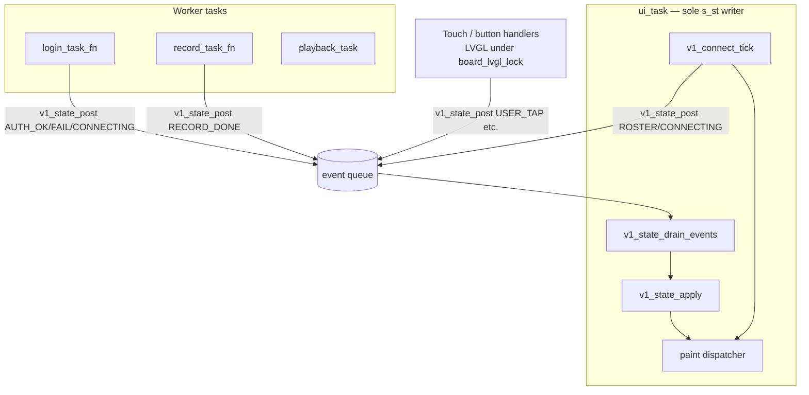

# Plan: v1 product isolation

| Field                          | Value                                                                 |
|--------------------------------|-----------------------------------------------------------------------|
| **Doc kind**                   | `feature-plan` (architecture / migration)                           |
| **Owners / areas**             | Firmware (x02), v1 server, web twin                                   |
| **Status**                     | `done` (all phases complete; cutover 2026-09-10)                          |
| **Targets**                    | Isolate v1 product code; split `x02_product_shell.c`; documented builds |
| **Last updated**               | 2026-09-10                                                            |
| **Supersedes / superseded by** | Product contract: [`v1-product-spec.md`](v1-product-spec.md)        |
| **As-built**                   | None — link to [`docs/features/`](../features/_template.md) when shipped |

**Context:** [`stability-synthesis.md`](../../stability-synthesis.md) §8.3 and §5 P2/P3 recommend separating auth from carousel before further feature work (INT-014 lesson: ~2100-line monolith edit correlated with PIN `checking...` hang). This plan does **not** implement moves — it defines the target layout, module boundaries, build targets, and incremental migration order.

**Related:** [`DEMO-MAP.md`](../DEMO-MAP.md), [`AGENTS.md`](../AGENTS.md), [`v1-demo-set.md`](v1-demo-set.md), [`BOX-UI.md`](../BOX-UI.md).

---

## At a glance

Today the v1 product firmware lives in **`firmware/v1/`** (eight modules + generated `v1_timing.h`); **`firmware/demos/x02_product_shell.c`** is a one-line flash shim (`make x02` → `FAMILY_DEMO=x02_product_shell`). Server/web twin: **`demos/server/v1_product/`**. Island demos **h01–h28** and personality **p01–p13** stay in `firmware/demos/`. Timing parity: **`shared/v1/timing.yaml`** → `make v1-timing` / `make check-v1-parity`.

| Phase | Outcome | Status |
|-------|---------|--------|
| [1 — Skeleton + timing contract](#phase-1--skeleton--timing-contract) | Directories, codegen, builds unchanged | `done` |
| [2 — Auth + connect extraction](#phase-2--auth--connect-extraction-before-carousel) | PIN/login/connect isolated; INT-014 guards | `done` |
| [3 — Carousel + record extraction](#phase-3--carousel--record-extraction) | Remaining modules; thin `x02_main` | `done` |
| [4 — Cutover + docs](#phase-4--cutover--docs) | Shim retained; AGENTS/DEMO-MAP updated | `done` |

---

## 1. Current state inventory

### 1.1 Firmware — v1 product binary

| Path | ~Lines | Role |
|------|--------|------|
| `firmware/demos/x02_product_shell.c` | **1** (shim) | Build id for `flash.py`; logic in `firmware/v1/` |
| `firmware/v1/x02_main.c` | **~430** | `app_main`, `ui_task`, paint dispatcher |
| `firmware/v1/v1_carousel.c` | **~1330** | Inbox, snap, playback, transport refresh |
| `firmware/v1/v1_record.c` | **~430** | Picker, overlay, record/upload worker |
| `firmware/demos/x01_product_shell.c` | 860 | Prior combined-host glue (superseded; keep until x02 stable) |
| `firmware/common/board.c` | 55 | BSP / LVGL lock / backlight |
| `firmware/common/wifi_sta.c` | 75 | Wi-Fi join |
| `firmware/common/http_bearer.c` | 70 | Bearer HTTP helper |
| `firmware/common/who.c` | 30 | Device identity slots (stamped at link) |
| `firmware/common/pass.c` | 12 | Demo pass marker |
| `firmware/main/CMakeLists.txt` | 52 | Single `FAMILY_DEMO` → one `.c` + common |
| `scripts/flash.py` | — | Maps `x02` → `x02_product_shell`; `V1_PRODUCT_DEMOS` token set |

**Build entry:** `make x02` / `make flash DEMO=x02` → `scripts/flash.py --demo x02` → `-D FAMILY_DEMO=x02_product_shell`.

**Tasks in monolith (FreeRTOS):**

| Task | Stack | Approx. lines | Touches |
|------|-------|---------------|---------|
| `ui_task` | 12288 | 3559–3716 | `s_st` transitions, probe scheduling, `paint()`, toast delay, sleep |
| `login_task_fn` | 8192 | 2242–2318 | HTTP `POST /v1/session/login`; **writes `s_st` directly** |
| `record_task_fn` | 8192 | 1798–1864 | Record/upload; **writes `s_st`** |
| `playback_task` | 12288 | 1643–1780 | Audio stream; flags only |

**State enum (`state_t`, L130–132):** `ST_CONNECTING`, `ST_WIFI_ERR`, `ST_ROSTER`, `ST_PIN`, `ST_CAROUSEL`, `ST_SETTINGS`, `ST_PICK`, `ST_RECORD`.

**Key global flags (cross-module coupling — INT-014 surface):**

| Flag | Writers | Readers |
|------|---------|---------|
| `s_st` | `ui_task`, `login_task_fn`, `record_task_fn`, input handlers, `enter_connecting_from_signin` | All `paint_*`, workers |
| `s_pin_login_busy` | PIN submit, `login_task_fn`, `enter_connecting_from_signin` | Probe guard, UI |
| `s_server_online` | `load_hangout*`, `server_mark_*` | Auth, carousel offline ribbon, record |
| `s_repaint` / `s_transport_dirty` | Everywhere | `ui_task` |
| `s_scroll_lock` / `s_carousel_locked` | Carousel snap | Touch handlers |

**Monolith regions (approximate line ranges for split planning):**

| Region | Lines | Functions / content |
|--------|-------|---------------------|
| Constants + types + globals | 1–260 | `#define`, `state_t`, ~80 statics |
| UI helpers + portraits | 262–887 | `paint_face*`, `hook_scr`, volume, NVS profile |
| HTTP / inbox API | 902–1104 | `http_json*`, `parse_inbox`, `reload_inbox` |
| Auth | 1041–1075, 2180–2318 | `login_user`, `login_task_fn`, PIN key handler |
| Connect | 554–706, 1867–1893, 2532–2900, 2834–2850 | `enter_connecting_from_signin`, `signed_out_hangout_probe`, `paint_connecting` |
| Carousel + playback | 1143–1797, 3044–3300 | Snap, transport, `paint_carousel`, `playback_task` |
| Record + picker | 1798–1865, 2989–3043, 3305–3324 | `record_task_fn`, `paint_pick`, `paint_record_overlay` |
| Sleep + settings | 3151–3498 | `paint_settings`, `paint_sleep` |
| Orchestration | 3500–3807 | `paint()`, `ui_task`, `app_main` |

**Dependencies (external):** ESP-IDF (Wi-Fi, HTTP, WS, NVS, codec), LVGL, BSP, `cJSON`, optional `assets/avatars/avatars.h`, `secrets.h` / `secrets.example.h`.

### 1.2 Server + web twin

| Path | ~Lines | Role |
|------|--------|------|
| `demos/server/v1_product/server.py` | 400 | FastAPI: hangout, session, inbox, admin, static mount |
| `demos/server/v1_product/client.py` | 169 | CLI smoke client |
| `demos/server/v1_product/ws.py` | 54 | WS inbox push |
| `demos/server/v1_product/web/box.js` | 868 | BOX-3 web twin (carousel, settings, picker stub) |
| `demos/server/v1_product/web/box.css` | 780 | Twin styling |
| `demos/server/v1_product/web/index.html` | 170 | Twin shell |
| `demos/server/_shared/*` | — | Registry, mailbox bootstrap (shared with other server demos) |
| `demos/parent/web/` | — | Lynn admin `/app` (mounted from `server.py` `WEB_DIR`) |

**Host commands (canonical for new v1 work):**

```bash
make v1-server          # HTTP :8080
make v1-server-tls      # HTTPS :8443 (dev certs)
# Twin: http://HOST:8080/box/
# Admin: http://HOST:8080/app/v1.html
```

**Not used for v1 product:** `demos/server/combined/` (x01 era), `h18_playback` twin (island demo).

### 1.3 Timing constants today (duplicated — P3 gap)

| Constant | Firmware (`firmware/v1/v1_timing.h`) | Web (`v1_timing.js`) | Spec |
|----------|----------------------------------|----------------|------|
| Connect retry | `CONNECT_RETRY_MS 5000` (L124) | *(not wired)* | v1-product-spec, BOX-UI |
| Connect probe timeout | `CONNECT_PROBE_MS 2500` (L125) | *(not wired)* | same |
| Snap scroll min/max | 380 / 720 (L88–89) | 380 / 720 (L29–30) | carousel-ui-refresh |
| Toast delay | 2500 ms hardcoded (L3649) | 2500 default (L215) | — |
| Record cap / silence | 180 s / 5 s (L75–76) | stub only | v1-product-spec resolved |
| Pick timeout | 10000 ms (L87) | — | v1-product-spec |

### 1.4 What stays where (maintainer decisions — not reopened)

- **Island demos** h01–h28, personality p01–p13 → remain `firmware/demos/`.
- **v1_product server** is canonical web twin host (not h18, not combined for new v1 work).
- **x02 replaces x01** as product binary; import helpers from passing island demos — do not merge all `.c` files ([`AGENTS.md`](../AGENTS.md)).
- **PIN model, record caps, Lynn box+web, three endpoints** — resolved in [`v1-product-spec.md`](v1-product-spec.md).

---

## 2. Proposed directory tree

```
family-link/
├── shared/v1/
│   ├── timing.yaml              # Single source: probe, snap, record, sleep, toast
│   ├── gen_timing.py            # Emits v1_timing.h + v1_timing.js
│   └── README.md                # Regenerate instructions
│
├── firmware/
│   ├── v1/
│   │   ├── v1_state.h / .c      # s_st owner API; event queue from workers
│   │   ├── v1_auth.h / .c       # PIN pad logic, login worker, session user
│   │   ├── v1_connect.h / .c    # Hangout probe, connecting/roster, server_online
│   │   ├── v1_carousel.h / .c   # Inbox, snap, playback, transport refresh
│   │   ├── v1_record.h / .c     # Picker, record/upload worker
│   │   ├── v1_ui_common.h / .c  # Faces, ribbons, sleep, settings chrome, chirps
│   │   ├── v1_api.h / .c        # HTTP/WS helpers shared by connect/auth/carousel/record
│   │   ├── v1_timing.h          # Generated — do not edit by hand
│   │   └── x02_main.c           # app_main, ui_task, paint dispatcher, task spawn
│   │
│   ├── demos/
│   │   ├── x02_product_shell.c  # Phase 4: thin shim #include "x02_main.c" OR deleted
│   │   ├── h01…h28, p01…p13, x01  # unchanged location
│   │   └── ...
│   ├── common/                  # unchanged (board, wifi, http_bearer, who, pass)
│   └── main/
│       └── CMakeLists.txt       # x02 → firmware/v1/*.c list
│
├── demos/server/v1_product/
│   ├── server.py                # unchanged path; docstring points at shared/v1
│   ├── web/
│   │   ├── v1_timing.js         # Generated — imported by box.js
│   │   ├── box.js               # import { … } from './v1_timing.js' (or script tag)
│   │   └── ...
│   └── ...
│
├── Makefile                     # add `make v1-timing`; existing x02/v1-server targets stay
└── docs/plans/v1-isolation-plan.md
```

**Shim strategy (incremental):** During migration, keep `firmware/demos/x02_product_shell.c` as the build target name (`FAMILY_DEMO=x02_product_shell`) but replace its body with `#include` aggregation or redirect CMake to `firmware/v1/x02_main.c` while `flash.py` demo id remains **`x02`**.

**Server adjustments (minimal):**

- Add generated `web/v1_timing.js`; `box.js` reads snap/probe/toast from it.
- Optional: `server.py` startup log prints timing.yaml version hash for parity debugging.
- No move of `demos/server/v1_product/` — it is already the canonical v1 host.

---

## 3. Module split and API boundaries

### 3.1 Module responsibilities

| Module | Owns (data / behavior) | Does **not** own |
|--------|------------------------|------------------|
| **`v1_state`** | `state_t s_st`; transition rules; `v1_state_get()`; **`v1_state_post_event()`** from workers | LVGL widgets, HTTP |
| **`v1_auth`** | PIN entry buffer, lockout, `login_task_fn`, `login_user()`, `s_pin_login_busy` lifecycle | `s_st` direct writes (posts events) |
| **`v1_connect`** | `s_server_online`, hangout NVS cache, probe timers, `enter_connecting_request()` | Applying `s_st` (posts `V1_EV_SERVER_LOST` / `V1_EV_ROSTER_READY`) |
| **`v1_carousel`** | `s_msgs`, focus, snap, `playback_task`, `ui_refresh_transport`, WS inbox dirty | Signed-out screens |
| **`v1_record`** | `record_task_fn`, picker timeout flag, upload | Carousel scroll state |
| **`v1_ui_common`** | `paint_face*`, ribbons, sleep anim, chirps, toast text, `request_repaint()` | State transitions |
| **`v1_api`** | `http_json*`, `format_url`, TLS, `parse_inbox`, `post_wav` | UI |
| **`x02_main`** | `app_main`, `ui_task`, `paint()` switch, input routing, task creation | Feature logic (delegates) |

### 3.2 Who owns `s_st` transitions

**Rule (post-split):** Only **`ui_task`** (via `v1_state_apply()`) may assign `s_st`. Workers and ISR-adjacent callbacks enqueue **`v1_event_t`**; `ui_task` drains the queue each 100 ms tick before probe/repaint logic.



**Signed-out path (INT-014 critical section):**

- While `v1_auth_login_active()` → **`v1_connect` must not** call `enter_connecting` or mutate PIN buffer; probe results are **deferred** (flag `connect_deferred`).
- `login_task_fn` entry gate (today L2249–2251) → replace with: capture `(user_id, pin, generation)` at submit; on mismatch post `V1_EV_AUTH_STALE` → ui_task repaints PIN or connecting — **never `continue` without UI reconciliation** ([`stability-synthesis.md`](../../stability-synthesis.md) P1 #4–5).

**Transition table (ui_task applies):**

| From | Event | To |
|------|-------|-----|
| `ST_*` (signed out) | server lost | `ST_CONNECTING` |
| `ST_CONNECTING` | roster ready | `ST_ROSTER` |
| `ST_ROSTER` | user picked | `ST_PIN` |
| `ST_PIN` | auth ok | `ST_CAROUSEL` |
| `ST_PIN` | auth fail / transport | `ST_PIN` or `ST_CONNECTING` |
| `ST_CAROUSEL` | shoulder | `ST_SETTINGS` |
| `ST_CAROUSEL` | circle tap | `ST_PICK` |
| `ST_PICK` | recipient / timeout | `ST_RECORD` / `ST_CAROUSEL` |
| `ST_RECORD` | record done | `ST_CAROUSEL` |
| any (allowed) | sleep idle | asleep overlay (sub-state, not `s_st`) |

### 3.3 Public headers (sketch)

```c
// v1_state.h
typedef enum { V1_EV_AUTH_OK, V1_EV_AUTH_FAIL, V1_EV_AUTH_STALE,
               V1_EV_SERVER_LOST, V1_EV_ROSTER_READY, V1_EV_RECORD_DONE, … } v1_event_t;
state_t v1_state_get(void);
void v1_state_post(v1_event_t ev, uint32_t gen);  /* callable from any task */
void v1_state_drain(void);                         /* ui_task only */
bool v1_state_may_probe(void);                     /* false if auth active */
```

```c
// v1_auth.h
void v1_auth_init(SemaphoreHandle_t work_sem);
void v1_auth_on_pin_digit(char key);               /* UI thread */
bool v1_auth_login_active(void);
uint32_t v1_auth_generation(void);
```

```c
// v1_connect.h
void v1_connect_init(void);
void v1_connect_tick(int64_t now_us);              /* ui_task: probe schedule */
bool v1_connect_online(void);
int v1_connect_user_count(void);
```

---

## 4. CMake / Makefile changes

### 4.1 CMake (`firmware/main/CMakeLists.txt`)

**Today:** one `DEMO_SRC` file + five `common/*.c`.

**Target behavior when `FAMILY_DEMO STREQUAL "x02_product_shell"`** (keep name for `flash.py` compatibility):

```cmake
set(V1_SRCS
    "${CMAKE_CURRENT_LIST_DIR}/../v1/x02_main.c"
    "${CMAKE_CURRENT_LIST_DIR}/../v1/v1_state.c"
    "${CMAKE_CURRENT_LIST_DIR}/../v1/v1_auth.c"
    "${CMAKE_CURRENT_LIST_DIR}/../v1/v1_connect.c"
    "${CMAKE_CURRENT_LIST_DIR}/../v1/v1_carousel.c"
    "${CMAKE_CURRENT_LIST_DIR}/../v1/v1_record.c"
    "${CMAKE_CURRENT_LIST_DIR}/../v1/v1_ui_common.c"
    "${CMAKE_CURRENT_LIST_DIR}/../v1/v1_api.c"
)
# idf_component_register(SRCS ${V1_SRCS} … common …)
# INCLUDE_DIRS …/v1 …/common
```

Island demos unchanged: single `firmware/demos/${FAMILY_DEMO}.c`.

**Pre-build hook:** `make v1-timing` (or CMake `add_custom_command`) regenerates `firmware/v1/v1_timing.h` from `shared/v1/timing.yaml`.

### 4.2 Makefile targets (exact)

| Target | Command | Purpose |
|--------|---------|---------|
| `make x02` | `python scripts/flash.py --demo x02` | Build + flash v1 product |
| `make flash DEMO=x02` | same via `$(DEMO)` | Explicit demo id |
| `make build-firmware DEMO=x02` | flash.py `--build-only` | Compile only |
| `make v1-server` | `python -m demos.server.v1_product.server --host 0.0.0.0 --port 8080` | Canonical host |
| `make v1-server-tls` | same + `:8443` + dev certs | TLS desk test |
| **`make v1-timing`** | `python shared/v1/gen_timing.py` | Regenerate `.h` + `.js` from `timing.yaml` |
| **`make check-v1-parity`** | `python scripts/check_v1_parity.py` | Compare yaml ↔ `v1_timing.h` ↔ `v1_timing.js` |

No change to `flash.py` demo id **`x02`** → `x02_product_shell` mapping unless the shim file is deleted; then map to `x02_main` or keep a one-line shim `.c`.

### 4.3 Documented developer workflow

```bash
# Terminal 1 — host
make v1-server

# Terminal 2 — twin (browser)
# http://localhost:8080/box/

# Terminal 3 — device
make v1-timing          # after editing timing.yaml
make flash DEMO=x02
make flash-monitor DEMO=x02   # INT-014: capture login logs before closing task
```

---

## 5. Migration steps (incremental — auth before carousel)

Each step = one PR, `make x02` green, device smoke per [`stability-synthesis.md`](../../stability-synthesis.md) P0.

### Phase 1 — Skeleton + timing contract

1. Create `shared/v1/timing.yaml` with all timing values from §1.3 + BOX-UI sleep/dim ids.
2. Add `gen_timing.py` → `firmware/v1/v1_timing.h`, `demos/server/v1_product/web/v1_timing.js`.
3. Add `make v1-timing`; wire `box.js` to generated constants (snap, toast; connect when twin gains connecting screen).
4. Add empty `firmware/v1/*.c` stubs + `x02_main.c` that `#include`s or links nothing yet — **CMake still builds monolith** (flag `V1_SPLIT=0`).

**Verify:** `make v1-server`, twin loads; `make x02` unchanged behavior.

### Phase 2 — Auth + connect extraction (before carousel)

5. Extract **`v1_api`** (HTTP/WS) — no behavior change.
6. Extract **`v1_ui_common`** (portraits, ribbons, chirps) — monolith calls into it.
7. Extract **`v1_state`** + event queue; **`ui_task` only** applies `s_st` (monolith workers temporarily call `v1_state_post` wrappers).
8. Extract **`v1_connect`**: probe, NVS hangout, `paint_connecting` / `paint_roster` / Wi-Fi error; defer probe when `v1_auth_login_active()`.
9. Extract **`v1_auth`**: PIN UI, `login_task_fn`; implement **login generation token** (P1 #4); fix entry gate → always post event + repaint.
10. **Device gate:** scripted PIN test (sign in → carousel) with serial log; **no carousel edits** until pass.

**Verify:** INT-014 repro attempted; logs show `{event, s_st, busy, gen}`; wrong PIN, server down → connecting per BOX-UI.

### Phase 3 — Carousel + record extraction

11. Extract **`v1_carousel`**: inbox, snap, playback, settings/back navigation; keep **`request_transport_refresh`** for non-screen transitions (P2 #8).
12. Extract **`v1_record`**: picker, overlay, `record_task_fn`.
13. Move sleep/settings paint into **`v1_ui_common`**; slim **`x02_main`**: `app_main`, `ui_task`, `paint()` switch, button registration.

**Verify:** carousel snap, play/scrub, record upload, WS inbox refresh; web twin snap still matches `v1_timing.js`.

**As-built (2026-09-10):** `v1_carousel.c`, `v1_record.c`, `x02_main.c` wired in CMake; `x02_product_shell.c` is a 1-line flash shim; `#define s_st` removed — workers/handlers use `v1_state_post_goto()` / `v1_state_apply()` (ui_task only). `make x02` green; `make check-v1-parity` green.

### Phase 4 — Cutover + docs

14. **Shim retained:** `firmware/demos/x02_product_shell.c` stays a comment-only flash id (`flash.py` maps **`x02`** → `x02_product_shell`; CMake links `firmware/v1/*.c`). Deleting the shim would require remapping `flash.py` / `FAMILY_DEMO`.
15. Update [`AGENTS.md`](../AGENTS.md), [`DEMO-MAP.md`](../DEMO-MAP.md), [`v1-demo-set.md`](v1-demo-set.md) with `firmware/v1/` paths and `make v1-timing` / `make check-v1-parity`.
16. *(Optional)* Tag pre-split commit for rollback — maintainer only; not required for cutover.

**Verify:** `make build-firmware DEMO=x02`, `make check-v1-parity` green (2026-09-10).

**As-built (2026-09-10):** Docs updated; shim unchanged; delegation C1–C4 and synthesis §9 marked complete.

---

## 6. Web twin parity — `shared/v1/timing.yaml`

### 6.1 Example schema

```yaml
# shared/v1/timing.yaml
version: 1
connect:
  retry_ms: 5000
  probe_ms: 2500
  wifi_retry_ms: 30000
carousel:
  snap_ms_min: 380
  snap_ms_max: 720
ui:
  toast_ms: 2500
  pick_timeout_ms: 10000
  idle_relock_ms: 60000
  dim_ms: 120000
  sleep_ms: 300000
record:
  max_sec: 180
  silence_sec: 5
  trim_ms: 150
auth:
  pin_tries: 5
  pin_cooldown_ms: 60000
```

### 6.2 Codegen outputs

| Output | Consumer |
|--------|----------|
| `firmware/v1/v1_timing.h` | `#define V1_CONNECT_PROBE_MS` etc. |
| `demos/server/v1_product/web/v1_timing.js` | `export const V1_CONNECT_PROBE_MS = …` |

**Policy:** Edit YAML only; run `make v1-timing`; commit both generated files (or generate in CI — see open questions).

**Future:** Extend twin with connecting-screen probe animation using same `retry_ms` / `probe_ms` (today web lacks connecting UX — parity gap noted in §1.3).

---

## 7. Risk register and rollback

| ID | Risk | Likelihood | Impact | Mitigation |
|----|------|------------|--------|------------|
| R1 | INT-014 regression during split | High | PIN hang | Auth+connect phase first; freeze carousel until PIN verified; generation tokens |
| R2 | CMake / flash.py demo name drift | Med | Broken flash | Keep `x02` / `x02_product_shell` ids; shim file until Phase 4 |
| R3 | Worker still writes `s_st` | Med | Races | `v1_state` audit; `-Werror` on direct `s_st` in non-ui files (grep CI) |
| R4 | LVGL heap regression | Med | White screen | Log heap after each paint in dev; no new eager widgets (P2 #10) |
| R5 | Web/firmware snap drift | Low | Twin useless | Generated timing; twin test in PR checklist |
| R6 | x01 bitrot | Low | Old demo breaks | Leave x01 in `demos/`; no split unless requested |

**Rollback strategy:**

1. **Git:** Tag `pre-v1-split` before Phase 2; revert PR restores monolith.
2. **Per-PR:** Keep monolith compiling until Phase 4; use `V1_USE_MODULES=1` CMake option to toggle (default 0 → 1 at cutover).
3. **Runtime:** No NVS schema change in this migration — rollback is flash-only.
4. **Server:** Server layout unchanged; rollback firmware only.

---

## 8. Open questions

Only items **not** resolved in [`v1-product-spec.md`](v1-product-spec.md) or [`OPEN-QUESTIONS.md`](../OPEN-QUESTIONS.md):

| # | Question | Notes |
|---|----------|-------|
| OQ-1 | **Codegen in CI vs manual `make v1-timing`?** | Spec silent; recommend commit generated artifacts + CI diff check. |
| OQ-2 | **x01 deprecation** | Spec says x02 replaces x01; no removal date — keep x01 until remote TLS path proven. |
| OQ-3 | **WS inbox handler module** | Likely `v1_carousel` with `v1_api` recv; confirm during Phase 3 PR. |

All product behavior questions (PIN, caps, endpoints, Lynn box+web) are **closed** — do not reopen.

---

## References

- INT-014 / monolith risk: [`stability-synthesis.md`](../../stability-synthesis.md) §8.3, §5 P1–P3
- Session edit size: [`first-interview.md`](../../first-interview.md) §4 (~2112 lines in one file)
- Build order: [`v1-product-spec.md`](v1-product-spec.md) § Suggested build order
- Do not merge all `.c`: [`AGENTS.md`](../AGENTS.md), [`DEMO-MAP.md`](../DEMO-MAP.md)
