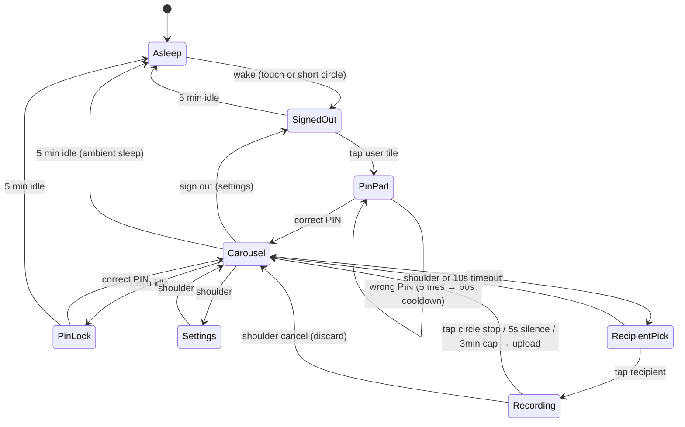

# Plan: v1 product spec

| Field                          | Value                                                                 |
|--------------------------------|-----------------------------------------------------------------------|
| **Doc kind**                   | `feature-plan` (approved product contract)                            |
| **Owners / areas**             | Server, endpoint firmware, web admin                                  |
| **Status**                     | `approved` (2026-09-04)                                               |
| **Targets**                    | Three endpoints (Lynn, Mazi, Arlo); async audio mailbox; web admin    |
| **Last updated**               | 2026-09-09                                                            |
| **Supersedes / superseded by** | Supersedes one-box + parent-phone v1 framing in older docs            |
| **As-built**                   | None — link to [`docs/features/`](../features/_template.md) when shipped |

**UI detail:** [`BOX-UI.md`](../BOX-UI.md). **Demo runbook:** [`v1-demo-set.md`](v1-demo-set.md). **Requirements:** [`REQUIREMENTS.md`](../REQUIREMENTS.md).

---

## At a glance

A **hangout** (group) has **users** (people) and **endpoints** (BOX-3 kiosks). Any user signs in on any endpoint with a PIN, browses an **audio carousel inbox**, and sends **1:1 or broadcast** voice notes. A **web admin** on the household server handles welcome audio, PIN reset, and outbound sends. **Async audio only** in this merge; live voice, drawing, and photos are later.

| Layer | v1 deliverable |
|---|---|
| **Server** | Hangout / user / endpoint model; per-user inbox; broadcast fan-out; session sync; web login; PIN admin; First Message seed |
| **Firmware** | Sign-in roster, PIN, carousel, record + upload, mute gate, chirps, sleep / wake, sign out, **connecting / server-wait UX** |
| **Web `/app`** | Lynn admin at `/app/v1.html`: login, PIN reset, welcome upload, send audio |

**Deployment:** Server on Lynn’s Windows box (fixed LAN IP, Ethernet). Lynn’s endpoint on the same LAN. Mazi and Arlo endpoints on **remote Wi-Fi** — firmware merge can prove on one LAN first; **Tailscale** (or similar) before hardware ships to the other house.

---

## Core model

| Concept | Rule |
|---|---|
| **Hangout** | Named group. Three users now; fourth later via server config. Minimum one user. |
| **User** | `user_id`, display name, profile picture, PIN hash, **inbox** (not tied to one box). |
| **Endpoint** | Physical BOX-3; `endpoint_id` + device token for Wi-Fi; `last_user_id` in NVS for wake portrait. |
| **Session** | User + PIN on glass → carousel. Carousel state syncs from **server per `user_id`**. |
| **Web client** | Same users as boxes. Web credentials are **separate** from box PIN. |

**Default room mapping (v1):** one endpoint per person’s space, but **any endpoint can sign in as any hangout user** via the sign-out roster + PIN.

```
endpoint  --HTTPS/WSS-->  server (Windows, home LAN)  <--  web /app (Lynn admin)
```

Messages are **`from_user` → `to_user`** (1:1) or **broadcast** (fan-out to all other users in the hangout). Inbox is keyed by **`user_id`**, not `endpoint_id`. Endpoint auth stays a **device token**; session auth is **user + PIN** on glass.

---

## Screens and states



### Signed out

- All hangout users as tappable tiles (profile pictures).
- Tap user → PIN pad.

### PIN pad

- 3×3 pad (1–9); **Boot** clears partial entry or returns to roster; **5 wrong attempts** → 60s lockout + `ask Lynn`.
- PIN required for **carousel** and **recording**.

### Carousel (signed in)

- **Center card** = current message; **peek cards** on left (older) / right (newer).
- Edge tap → animate new card to center; **pause** playback; save **`position_ms`** on server.
- Return to a message → restore scrub position.
- **First Message** at oldest slot; nothing to the left when centered on it.
- Messages sorted by **server time**; **`read`** only after **Play** (not on card select).
- Unread vs read: distinct chrome.
- **Play / Pause** on glass; **timeline always visible**; drag to scrub.
- Hint: `tap circle to send` (once per session).
- **Shoulder** → scrollable settings (volume, color, face, sign out).

### Settings (signed in)

- Scroll order: **volume** → **color** (10 swatches) → **face** (geometry + 12 avatars) → **sign out**.
- Volume slider with numeric readout; 12px right margin.
- `PUT /v1/profile` saves `avatar_slot` + `accent_hex` per user.
- **Shoulder** → back to carousel.

### Recipient picker

- Tap circle → touch-only: **Lynn | Mazi | Arlo | Audrey | Everyone**.
- Tap recipient → recording starts immediately (start chirp).
- Shoulder or **10s timeout** → cancel, back to carousel.

### Recording

- Tap circle → stop + upload (stop chirp).
- **5s silence** below threshold → auto-stop.
- **3 min** hard cap.
- **150ms** leading trim after start.
- Mute latched → block start + `unmute first`; near-zero RMS **0.5s** → abort without send.
- Boot → **cancel discard** (no upload).
- Tap circle while recording → stop + upload.

### Sleep / wake

- **2 min** dim (32% backlight) → **5 min** ambient sleep (session unchanged).
- **Ambient sleep** replaces a fully black screen so the box reads as asleep, not dead or unplugged. Bedroom-safe: very low backlight (~4–6%), not full off.
- **Entry:** ~1.5 s fade from dim UI into a dark sleep screen.
- **Asleep screen:** dark navy fill + slow bottom-half accent glow (user accent when signed in). 5 s breathe cycle on glow and backlight. Every ~25 s, a soft pulse in the zone above the physical red circle (no fake button drawn on the LCD).
- **Signed in + unread:** small count badge pulses with the glow (count only — no message body).
- **Wi-Fi error / connecting:** do **not** enter ambient sleep; these screens stay visible.
- Wake: touch anywhere on LCD or **short circle tap** → full brightness + prior screen.

### Server wait (“connecting”) — signed-out endpoints

When **`GET /v1/hangout` fails** and nobody is signed in, the endpoint stays on a **connecting** screen — not sign-in tiles, not a developer error, not a timed “connection failed” panel. The household server may be booting or the link may be slow; the box **keeps trying**.

| Rule | Contract |
|---|---|
| **When** | Signed out + server unreachable (HTTP fail on hangout probe) |
| **Copy** | `connecting` only (no ellipsis). No hostnames, CLI hints, or `secrets.h` |
| **Visual** | Screen-centered gold mailbox (~1.5×), then label, then **three gold dot circles** (not text) |
| **Dots** | 1 → 2 → 3 over each **5 s** retry period (~1.7 s per step); reset to **1 dot** after each probe finishes |
| **Retry** | `GET /v1/hangout` every **5 s**; **2.5 s** HTTP timeout per probe so UI animation stays smooth |
| **Success** | **200** with users → **sign-in roster** |
| **Cache** | Last hangout roster may persist in **NVS** for fast roster after reconnect; **do not show tiles while offline** |
| **No timeout** | Do not switch to a separate error screen while retries continue |
| **Wi-Fi down** | **Separate** `no Wi-Fi` screen — not the connecting screen |
| **Signed in** | Server loss → carousel **offline** ribbon; block send/PIN-dependent server ops; not connecting |
| **Signed-out heartbeat** | While signed out, probe hangout every **5 s** on roster **and** PIN — not only on connecting; failed probe → connecting (clear partial PIN) |
| **PIN verify** | 4th digit → **`checking...`**; login POST on worker task; **2.5 s** timeout; transport fail → connecting, not a frozen pad |

**UI detail:** [`BOX-UI.md`](../BOX-UI.md) § Connecting, § Connection confidence. **Implementation:** `firmware/demos/x02_product_shell.c`.

---

## Physical controls (v1)

| Control | Job |
|---|---|
| **Red circle — short tap** | Wake from sleep; carousel → picker; recording → stop + upload |
| **Red circle while playing** | Ignored |
| **Shoulder** | Carousel → settings; settings → carousel; cancel recipient picker or active recording (discard + chirp down); PIN pad clears partial entry or back to roster |
| **Mute latch** | Hardware mic gate; block record when latched; show on-screen warning |

---

## Messaging

### 1:1

`POST` with `to_user_id` → one inbox row for that user.

### Broadcast (`Everyone`)

Server stores **one blob**, creates **N−1 inbox rows** (one per other hangout member), shared `broadcast_id`. No reply-all in v1.

### Roster

`GET /v1/hangout` — member names for recipient picker.

### Per-user server state

| Field | Meaning |
|---|---|
| `last_viewed_seq` | Carousel focus (which card is centered) |
| per-message `read` | Set on first **Play** |
| per-message `position_ms` | Scrub position; survives card switch and endpoint change |
| `avatar_slot` | 0 = geometry; 1–12 = built-in creature avatar |
| `accent_hex` | User-chosen identity color (10 swatch palette) |

### First Message

- On **user create**, server inserts `seq=1`, `kind=audio`, `system=true`, display `from: Family` (hangout name).
- Lynn uploads one WAV via `/app`; **all users** (including Lynn) receive it in their chain.
- Replace later → **new** system message (history preserved).

---

## Web `/app` (Lynn admin)

- Login: username + web PIN/password (**not** box PIN).
- **PIN reset** per user — new PIN shown **on web only**; box shows `PIN was reset` / `ask Lynn`.
- Upload / replace welcome audio.
- Send audio to one user or broadcast.
- Endpoint registry and hangout membership (config).

---

## Audio UX

| Item | Spec |
|---|---|
| Record start / stop | Two-tone chirps (step up / step down); distinct from h17 button chirps |
| Mute gate | Block record; `unmute first` on screen |
| Pre-roll transition | Nice-to-have |
| Quiet hours | Later |

---

## In scope (this merge)

| Item | Notes |
|---|---|
| Carousel audio inbox | Import h18 widgets, h19 carousel animation |
| Record + upload | h08 path + VAD silence-stop, trim, caps |
| Recipient picker | 1:1 + Everyone |
| User login + PIN | h03 pad; sign-out roster |
| First Message seed | Server on user create |
| Mute gate + record chirps | h17 GPIO + chirp pattern |
| Sleep / wake | Dim schedule + ambient sleep screen (bedroom-safe low backlight) |
| Web admin | Login, PIN reset, welcome, send |

**Product binary:** successor to **x01** (e.g. **x02**), importing passing helpers — not merging every `.c` file.

### Suggested build order

1. **Server schema** — users, hangouts, endpoints, per-user inbox, broadcast, First Message, web login stub.
2. **Session shell** — signed-out roster, PIN, idle lock, sign out, sleep / wake (h03).
3. **Carousel** — peeks, play / pause, scrub, position sync (h18, h19 motion).
4. **Record path** — recipient picker, silence-stop, trim, mute gate, chirps (h08, h17).
5. **Web admin** — welcome upload, send, PIN reset.
6. **Remote path** — TLS + Tailscale doc before kids’ boxes leave home LAN.

---

## Out of scope (this merge)

| Item | Notes |
|---|---|
| Live voice (h21) | Sync phase |
| Live shared draw (h26) | Sync phase |
| Drawing notes (h27) | Later; carousel reserves `kind` |
| Photos | Later |
| iPhone mic / mobile parent app | Lynn uses box + web |
| 4th user | Server config only when added |
| Presence strip | Dropped for v1 |
| Fullscreen message detail | Carousel only in v1 |

Design async paths so **sync** (live voice, live draw) can attach later without rewriting inbox or session models.

---

## Resolved decisions (formerly open)

| Topic | Decision |
|---|---|
| PIN model | Per-user; Lynn sets / resets via `/app`; 1 min idle relock; 5 tries → 60s cooldown |
| PIN gates | Carousel **and** recording |
| Record interaction | Tap circle → picker → record; tap circle stop; 5s silence; 3min cap |
| Home UI | Carousel with peek cards; not phone list; not Boot-as-next |
| Parent client | Lynn’s box + web admin; not phone-primary |
| Topology | Three endpoints; hangout with four users; broadcast supported |
| x01 vs successor | New product demo replaces x01 glue |
| Child → parent photos | Out of this merge |
| Live hangout PTT | Out of this merge |

---

## References

- Demos to import: h03, h08, h17, h18, h19, combined WS `inbox` alerts
- Firmware shell today: `firmware/demos/x02_product_shell.c`
- Host today: `demos/server/combined/`
- UI brief: [`BOX-UI.md`](../BOX-UI.md)
