# Endpoint login experience

Status: interview draft — reconstruction confirmed; later checkpoints pending
Experience ID: EXP-LOGIN
Revision: 1.7
Owner: Product owner
Approval: No approval claimed; no implementation authorization implied

## 1. Identity, scope, and authority

This hardware-mediated, continuous experience starts at the unmuted, signed-out login flow and covers server readiness, hangout user discovery and selection, PIN entry, and successful authentication. On server-confirmed authentication it enters the signed-in message carousel. Physical mute/unmute is outside the ordinary journey, but mute's sign-out/display behavior is recorded as a related invariant and interruption because it affects login continuity. Other signed-in behavior is out of scope.

The owner confirmed the reconstruction and the primary journey boundary on 2026-10-10. DEC-001–DEC-005 are owner-decided for the statements recorded from that reconstruction. Details not included in those statements remain OPEN. `MUST` expresses a requirement only after its decision is accepted. V1 evidence is historical and does not establish v2 policy.

### Sources

| ID | Source and authority | Relevant material |
|---|---|---|
| SRC-OWNER-001 | Product owner, 2026-10-10; confirmed at reconstruction checkpoint | Endpoint power/mute, login and connecting stages, card interaction/order/update behavior |
| SRC-V1-UI-001 | Historical v1 POC archive; evidence only | BOX-UI: device/control description; Connecting; Connection confidence; PIN verify flow and PIN script |
| SRC-V1-AUTH-001 | Active v1 assessment; implementation evidence | [Authentication and connectivity assessment](../../v1-assessments/authentication-connectivity.md), user-visible stages and open decisions |
| SRC-V1-CAR-001 | Active v1 assessment; implementation evidence | [Carousel and playback assessment](../../v1-assessments/carousel-playback.md), roster/card scene behavior is partly outside its focus |
| SRC-STD-001 | Normative engineering standard, not product policy | [Client application coding standards](../../standards/client-application-coding-standards.md) §§1–7, 9 |
| SRC-POLL-001 | Supporting concept guide | [Session stage versus background poller](../../v1-assessments/session-stage-vs-background-poller.md) |
| SRC-UI-001 | Supporting concept guide | [UI update taxonomy](../../v1-assessments/ui-update-taxonomy.md) |
| SRC-V1-CONTRACT-001 | Historical v1 product contract | [V1 product spec](../../../poc-v1/docs/plans/v1-product-spec.md) and [V1 UI behavior](../../../poc-v1/docs/BOX-UI.md), signed-out probe and PIN timing |
| SRC-V1-ASBUILT-001 | Active v1 assessment; implementation evidence summarized from firmware sources | [Authentication and connectivity assessment](../../v1-assessments/authentication-connectivity.md), v1 probe and Wi-Fi recovery behavior |
| SRC-V1-HB-001 | Historical v1 POC demos; demo evidence only | [Device demos](../../../poc-v1/docs/DEVICE-DEMOS.md) h20/h24 and [server demos](../../../poc-v1/docs/SERVER-DEMOS.md), heartbeat payloads and smoke cadence |

**Source conflict:** the historical hardware brief describes mute as a microphone gate and recording as blocked while muted. The owner confirmed the v2 mute behavior as turning the endpoint display off and signing out the user while leaving the endpoint powered. This specification records the owner's v2 decision; historical behavior is not controlling.

**Revision history:** 0.1 — initial interview draft; 0.2 — reconstruction and roster append/removal; 0.3 — PIN proposal and success destination; 0.4 — PIN continuity/removal/mute exceptions; 0.5 — unknown-user refresh, focus fallback, empty roster; 0.6 — unknown-user refresh failure and retry flow; 0.7 — four PIN attempts with 2/4/8-second schedule; 0.8 — connectivity classification, roster recency, boot mute/storage fallback, eight-user minimum, and retry recovery; 0.9 — decided BOOT cancel, partial-PIN inactivity timeout, mute interruption, in-memory-only recency, and accepted retry timing; 1.0 — confirmed adaptive roster cadence, unmute readiness check, brief transient-failure retry intent, health heartbeat cadence/stale threshold, and idempotent PIN retries; 1.1 — confirmed one roster retry then connecting, immediate roster check when Wi-Fi returns, accepted v1 four-digit interaction and five-failure/60-second cooldown, and deferred heartbeat/idempotency communication protocol details to a separate contract; 1.2 — made the single roster retry immediate, deferred its request timeout to the communication contract, and confirmed v1 cooldown counter behavior; 1.3 — delegated PIN visual presentation to a separate screen spec, selected neutral cooldown copy, and assigned responsiveness budgets to engineering measurement/proposal; 1.4 — chose split-pane and selected-user identity/status, with keypad/BOOT conflicts OPEN; 1.5 — restricted PIN digits to 1–9, specified name and avatar, and refined BOOT behavior by PIN-entry state; 1.6 — set roster request timeout to one second, set PIN operation-result retention to one minute, and accepted v1 PIN masking/alignment and error placement preference; 1.7 — confirmed duplicate PIN requests replay the first result without reprocessing, resolving the lost-response conflict. No contract approval is claimed.

## 2. Scenario and intended experience

The endpoint remains powered continuously. Its physical mute control hides the display and logs out the user when switched on; switching it off wakes the display to sign-in. If Wi-Fi is unavailable, show a dedicated Wi-Fi-unavailable message screen. If Wi-Fi is available but a valid server response is unavailable, show connecting with an animated indicator while actively retrying. A valid readiness response is HTTP 200 with valid response information. A person browses user cards for the endpoint's assigned hangout, selects their card, and proceeds to PIN login. The roster is server-owned, with local endpoint login recency used to order familiar users.

The top third of the login layout contains a left-justified “Sign in as ...” message. The bottom two thirds contain a horizontally browsable carousel of touchable user cards. A tapped user card becomes focused and centered where the carousel geometry permits, then opens PIN entry. The first and last cards need not center. Hangouts support at least eight users in v2; expansion beyond that is deferred to v3. User IDs are unique and immutable, while user details may change.

## 3. Physical and interaction context

- The physical mute control is a latch. Owner intent is that the endpoint remains powered in both positions.
- Muted: screen off and user signed out. Unmuted: screen on and signed-out login flow begins.
- Login uses touch swipe and tap. The v2 visual constraints are being defined in `docs/product/device-ui/screens`. Accessibility is covered through button sizing and visual/audio feedback; screen-reader and touch-less-display support are not required, English is the only localization language, and no additional color-blind support is required.
- V1 evidence references an ESP32-S3-BOX-3, 320 × 240 touch LCD, and a top-edge mute latch; these are historical device facts, not yet confirmed v2 constraints.
- The owner supplied the shared login layout proportions and heading copy. Card dimensions, art, focus treatment, accessibility, orientation, and localization are OPEN.

## 4. Experience model and ordinary journey

| Stage | Entry | Exit | Primary actions | Surviving work |
|---|---|---|---|---|
| Connecting | Unmuted, signed out, Wi-Fi available, no valid server response | Server returns HTTP 200 with valid response information; Wi-Fi becomes unavailable; or mute | Observe animated activity; mute | Retry operation and animation continue while stage remains active |
| Wi-Fi unavailable | Wi-Fi connection unavailable | Wi-Fi returns; or mute | Observe Wi-Fi-unavailable message; mute | Retry/recovery details OPEN |
| Muted | Physical mute latch is on | Latch switches off | Display stays off; endpoint remains powered | No user session; unmute begins immediate readiness check |
| Sign-in roster | Server reachable and roster available | User card selected; server unavailable; or mute | Swipe, tap a card, mute | Periodic server roster refresh; local login recency |
| Empty hangout | Server reachable; roster contains no users | Roster becomes non-empty; server unavailable; or mute | Observe empty-hangout message; mute | Periodic server roster refresh |
| PIN entry | User card selected | PIN submitted; BOOT with zero/partial digits; partial-PIN idle timeout; or mute | Enter four digits from 1–9; BOOT with no digits returns to roster; with 1–3 digits clears them and remains on PIN entry; after digit four BOOT is ignored; 60 seconds since last digit returns to roster; mute cancels and turns off display | Selected identity; partial PIN held only in active view |
| PIN verification | Four digits submitted | Authenticated; rejected; server reports unknown user; retry sequence exhausted; or mute | Four attempts total; 1-second attempt timeout and 1/2/4-second retry delays; BOOT is ignored after the fourth digit; mute cancels immediately and turns off display | Immutable submitted user/PIN snapshot; unique operation key reused across retries |
| Signed-in message carousel | Server confirms the selected user's PIN | Mute/sign-out or later signed-in behavior (outside scope) | Begin signed-in message experience | Authenticated session; endpoint-local login recency updated after confirmation |

```mermaid
stateDiagram-v2
  [*] --> Connecting: unmuted, signed out, server unavailable
  [*] --> Roster: unmuted, signed out, server ready
  [*] --> WifiUnavailable: unmuted, Wi-Fi unavailable
  Connecting --> Roster: server returns roster
  Connecting --> EmptyHangout: server returns empty roster
  Connecting --> WifiUnavailable: Wi-Fi unavailable
  Roster --> Connecting: server unreachable
  Roster --> WifiUnavailable: Wi-Fi unavailable
  Roster --> EmptyHangout: roster becomes empty
  EmptyHangout --> Connecting: server unreachable
  EmptyHangout --> WifiUnavailable: Wi-Fi unavailable
  EmptyHangout --> Roster: roster becomes non-empty
  Roster --> PinEntry: select user card
  PinEntry --> PinEntry: background reachability lost / retain screen until submit
  PinEntry --> Roster: BOOT with no digits / return to roster
  PinEntry --> PinEntry: BOOT with 1-3 digits / clear digits
  PinEntry --> PinVerifying: fourth digit / submit PIN
  PinVerifying --> PinVerifying: BOOT / ignore after four digits
  PinEntry --> Roster: 60 seconds since last digit / partial PIN timeout
  PinEntry --> Muted: mute / cancel and turn off display
  PinVerifying --> MessageCarousel: server confirms authentication
  PinVerifying --> PinEntry: wrong credential (v1 proposal; acceptance OPEN)
  PinVerifying --> Roster: server reports unknown user / request updated roster
  Roster --> Connecting: immediate roster refresh fails after unknown user
  PinVerifying --> Connecting: timed-out submit retries exhausted
  PinVerifying --> Connecting: server unavailable (v1 proposal; policy details OPEN)
  Connecting --> Roster: valid server response, roster non-empty
  WifiUnavailable --> Connecting: Wi-Fi restored; server not yet ready
  WifiUnavailable --> Roster: Wi-Fi restored and valid roster available
  Connecting --> Muted: mute / sign out and hide display
  WifiUnavailable --> Muted: mute / sign out and hide display
  Roster --> Muted: mute / sign out and hide display
  EmptyHangout --> Muted: mute / sign out and hide display
  PinEntry --> Muted: mute / cancel, clear PIN and hide display
  PinVerifying --> Muted: mute / cancel immediately; ignore late result
  Muted --> Connecting: unmute / immediate server readiness check
  Muted --> WifiUnavailable: unmute / Wi-Fi unavailable
```

Ordinary flow: an unmuted signed-out endpoint checks Wi-Fi and the server. If Wi-Fi is unavailable it shows the dedicated Wi-Fi-unavailable message; if Wi-Fi is available but server readiness is not, it presents connecting activity and retries. Readiness requires HTTP 200 with valid response information. Once a valid roster is available, it displays “Sign in as ...” above user cards. The person swipes through the cards and taps a user. The selected card receives focus and centers when possible; the screen advances to PIN entry. The user enters four digits from 1–9; after the fourth digit the endpoint begins verification. On server-confirmed authentication, the endpoint enters the signed-in message carousel and updates local login recency for that user.

## 5. Stage and operation contracts

### Related mute interruption

- Owner-decided behavior: switching mute on while signed in logs out the user, turns off the display, and leaves the endpoint powered. Switching mute off turns on the display and presents the login flow.
- If mute is switched on during PIN verification, cancel sign-in immediately. Ignore all late results from that login operation.
- Exact mute LED, audio, and screen blanking/wake latency are OPEN. If the device boots with mute latched on, it boots powered with the display off.

### Server readiness and roster refresh

- The server owns the hangout roster. While the endpoint is on and displaying users, it periodically requests the roster to keep its cards synchronized. The owner confirmed that newly received users append to the displayed list and users removed by the server disappear from the cards.
- Unreachable server while signed out leads to a connecting screen with an animated indicator and active attempts. A successful response returns to or updates the roster.
- If reachability is lost while PIN entry is open, remain on PIN entry until the user submits. If the server then responds that the selected user is unknown, return to the sign-in roster. Reconciliation/copy details after that response remain OPEN.
- V1's signed-out hangout probe runs at a fixed 5-second cadence with a 2.5-second request timeout, while the roster and PIN screen are shown; the documented policy shows no exponential backoff. V1's Wi-Fi recovery retry is configured at 30 seconds. The v1 contract has a separate Wi-Fi-unavailable screen. These are v1 reference values, not automatic v2 choices.
- V1 POC heartbeat demos are presence-oriented, not a settled endpoint-health policy: h20 reports mute-latch availability and receives peer online/availability; h24 can batch device logs on each heartbeat. A server-twin smoke demo posts every 2 seconds, but that demo cadence is not a production device requirement. No general v2 heartbeat interval is established by those demos.
- V2 readiness requires HTTP 200 with valid response information. Wi-Fi unavailable shows a dedicated Wi-Fi-unavailable message screen; malformed/unclassified server errors show connecting. The exact copy and recovery behavior for these screens remain OPEN.
- **Owner-decided roster refresh policy:** when the roster is active, refresh every 60 seconds. If there has been no user activity and no roster change for 10 minutes, slow refreshes to every 5 minutes. Return to 60-second refreshes after user activity or a roster change. On unmute, check connectivity before showing selectable cards. A single failed periodic check gets one immediate retry; if that retry fails, leave the roster for connecting. Request timeout remains OPEN for the communication-protocol contract.
- When Wi-Fi returns, check connectivity/refresh the roster immediately. The request timeout is one second. Response fields, validation rules, freshness window, and protocol details for “valid response information” remain OPEN for the separate communication-protocol contract. Make the one immediate retry after a transient periodic-check failure before replacing the roster with connecting.
- **Owner-decided endpoint-health heartbeat:** independently of roster requests and user presence, send a health heartbeat every 60 seconds while powered, including while muted, plus on boot and connectivity changes. Mark the endpoint stale after three missed beats. The heartbeat describes device health, not whether a user is online. Payload/protocol and outage retry behavior remain OPEN. The older v1 POC heartbeat demos are presence-oriented and do not define this policy.
- The assessment recommends that roster polling run off the presentation owner and that poll results not overwrite active user operations. These are engineering constraints, not permission to choose unresolved UI policy.

### Roster and card selection

- Layout: top third, left-justified “Sign in as ...”; bottom two thirds, horizontal user-card carousel.
- Cards are swipeable and tappable. Tapping selects/focuses the card and opens PIN entry. The carousel centers the focused card in the viewport, including when only one user is shown or when the focused user is first or last (outward empty track space is expected).
- Display order: endpoint-local most recent successful login first. Reconcile each server roster against local recency: remove stored IDs absent from the server response, preserve relative recency for retained users, and append server users not yet in local history. If recency cannot be retrieved or applied, use server response order. A server reorder does not override local recency.
- User IDs are unique and immutable; other user profile details may change. Reflect updated details for the same user ID. Malformed roster handling remains OPEN.
- If a user disappears from a roster refresh while their PIN screen is open, keep the selected identity and allow PIN submission. If the server responds that the identity is unknown, return to the sign-in roster and immediately request an updated user list. While that refresh is in flight, show `Updating hangout ...` in place of `Sign in as ...` and disable carousel touch; when a non-empty roster arrives, restore `Sign in as ...` and re-enable carousel touch. If that request fails, enter connecting.
- If the focused card is removed while the roster screen is open, focus the nearest remaining card at an earlier index. If the removed card was first, focus the next card. If no users remain, use the empty-hangout state. Reconcile by stable user identity rather than index alone.

### Empty hangout

- Entry: the endpoint can reach the server and receives an empty hangout user list, either on initial readiness or roster refresh.
- Show no user cards. Replace the “Sign in as ...” heading with **`No people in this hangout`** (see [`SCR-EMPTY-HANGOUT`](../device-ui/screens/SCR-EMPTY-HANGOUT.md)).
- Exit to the sign-in roster when a non-empty roster arrives; enter connecting if server reachability is lost while signed out.

### PIN login

- Selection freezes the user identity for the PIN operation.
- BOOT behavior depends on PIN progress: with no digits entered, return to user selection; after one to three digits, clear them and remain on PIN entry; after the fourth digit, ignore BOOT while verification is in progress.
- If one to three PIN digits have been entered and no further digit is entered for 60 seconds, clear the partial PIN and return to user selection. Each entered digit restarts the timeout; this is an endpoint inactivity timeout, not an authentication lockout.
- **Owner-accepted v1-derived flow:** enter four digits, showing one right-justified masked `*` immediately for each digit; after digit four, show all four marks and `checking...` while verification runs asynchronously; ignore more keypad input while checking; on accepted credentials enter the signed-in message carousel; on wrong PIN clear entry and briefly replace the selected-user heading with `wrong pin`; a timeout is not a wrong PIN. Five wrong-PIN failures trigger a 60-second cooldown, following v1. The failure counter tracks the currently selected user; switching selected users resets the tracked counter, successful login clears the counter and lock, and cooldown expiry clears the counter. Four total attempts with a 1-second timeout and retry delays of 1, 2, and 4 seconds apply only to a timed-out submission, for about 11 seconds maximum; these transport retries do not count as wrong-PIN failures. If all four transport attempts fail, enter connecting; when connectivity later returns, return to user selection. Malformed or unclassified server errors show connecting. Remaining visual details are tracked in `SCR-PIN-ENTRY`.
- PIN screen geometry, keypad layout, and visual/success feedback are delegated to [`SCR-PIN-ENTRY`](../device-ui/screens/SCR-PIN-ENTRY.md). Cooldown feedback uses neutral wording communicating “Too many attempts. Try again in <seconds>”; exact layout is defined there. The 60-second partial-entry timeout and conditional BOOT behavior are decided. Historical v1 timing conflicts: the product brief describes a 2.5-second login timeout while the assessment reports a six-second implementation value; the owner-selected 1-second per-attempt timeout is the v2 decision.
- **Owner-decided duplicate-submit contract:** assign a unique operation key to each PIN submission and reuse it with the exact same request for every retry. A new PIN submission gets a new key. Retain the final result for one minute. For a duplicate key, do not reprocess the login; log the duplicate and return the first request's recorded result, including after a lost success response. Wire representation and handling of simultaneous duplicates or a reused key with different request content remain for the separate communication contract.
- If all PIN attempts fail and connectivity later returns, return to user selection and refresh/show the current roster; do not resume the previous PIN entry.
- Pressing mute at either PIN stage cancels login, logically returns to user selection, clears partial PIN state, and turns off the display. Unmuting starts the signed-out readiness flow again.
- On server-confirmed authentication, update that user's endpoint-local login recency and enter the signed-in message carousel. Local recency must not advance merely because PIN entry was submitted or because a response is still pending.
- Any asynchronous result must be bound to the submitted user and current session/operation. Stale or late results must not sign in a different user. This follows SRC-STD-001 and is not a product choice.
- Mute during PIN verification cancels the login operation immediately; its completion cannot restore authentication.

## 6. Continuity, data, and side effects

- Remote truth: current hangout user membership comes from the server.
- Local truth: successful-login recency is held in memory only for the current boot lifetime; it is not persisted and this feature does not log recency failures.
- Reconcile server membership with endpoint-local in-memory recency: prune local IDs absent from the server, preserve order of retained IDs, and append users without recency history. If no recency is in memory, including after reboot, use server response order.
- User IDs are unique and immutable; user profile details can change and should refresh from server data. New users append; removed users disappear from cards.
- User login is a remote side effect. Each PIN submission has a unique operation key; retries reuse the same key and exact request, and the server replays the final result for duplicate requests. A new submission gets a new key. Wire representation, result-retention duration, and invalid key reuse handling remain OPEN engineering/API details.
- If the physical mute latch is on during boot, boot the endpoint powered with its display off. There is no persistent recency storage or recency-failure logging in this experience.
- Muting signs out per owner input. Local login recency updates only after server-confirmed authentication. Mute during PIN entry or verification clears PIN state and turns off the display.

## 7. Limits and responsiveness

V2 hangouts must support at least eight users; expansion beyond eight is deferred to v3. The roster cadence, heartbeat schedule, and PIN retry idempotency behavior are decided. Poll retry details, response validation, heartbeat/API protocols, animation, PIN interaction and result deadline, and wake response targets still need definition or measurement before implementation readiness. Visual constraints are being defined in `docs/product/device-ui/screens`. Accessibility is covered through button sizing and visual/audio feedback; screen-reader and touch-less-display support are not required. English is the only localization target. No additional color-blind support requirement is specified. The client standard requires bounded input/render work, observable worker outcomes, and operation timeouts.

## 8. Acceptance scenarios and evidence

These are draft scenario outlines, not completed verification.

| ID | Starting condition and event | Expected result | Requirements |
|---|---|---|---|
| SCN-001 | Signed in; switch mute on | Endpoint stays powered, signs out, screen goes off | EXP-001, EXP-002 |
| SCN-002 | Muted; switch mute off | Screen wakes and signed-out readiness flow begins | EXP-003 |
| SCN-003 | Unmuted and signed out; server unavailable | Connecting screen animates while retrying; no selectable roster | EXP-004, EXP-005 |
| SCN-004 | Connecting; server returns roster | Sign-in layout and current hangout user cards appear | EXP-004, EXP-006 |
| SCN-005 | Roster available; tap a non-edge card | Card gets focus/centers and PIN stage opens | EXP-007 |
| SCN-006 | In-memory login recency is available | Users appear in endpoint recency order | EXP-008 |
| SCN-007 | Device has rebooted and has no in-memory recency | Users appear in server response order | EXP-008, EXP-032 |
| SCN-008 | Roster refresh adds and removes users | New user appends; removed user's card disappears | EXP-009 |
| SCN-009 | Old roster or login response arrives after a newer operation/session | Stale result cannot replace current roster/session or authenticate another identity | EXP-010 |
| SCN-010 | Endpoint remains on roster through refresh; one periodic check fails | Refresh follows active/idle cadence; make one retry, then show connecting only if it fails too | EXP-011 |
| SCN-011 | Server confirms authentication for the selected user | Enter the signed-in message carousel and update local recency for that user | EXP-012, EXP-013 |
| SCN-012 | PIN is submitted but server confirmation has not arrived or reports failure | Do not advance local login recency; failure stage/copy follows the still-open policy | EXP-013 |
| SCN-013 | Enter the four-digit PIN | Each digit updates one dot; fourth digit shows four dots and `checking...`; further taps are ignored while verification is pending | EXP-014 |
| SCN-014 | Server becomes unreachable while PIN entry is open | Keep the PIN screen and entered digits until submit | EXP-015 |
| SCN-015 | Selected user was removed; user submits PIN; server returns `unknown user` | Return to sign-in; show `Updating hangout ...` and disable carousel until roster refresh applies | EXP-016, EXP-036 |
| SCN-016 | Mute is switched on during PIN verification; login later returns success | Cancel sign-in immediately, turn display off, and ignore the late result | EXP-017 |
| SCN-017 | Server responds `unknown user` to submitted PIN | Return to sign-in and request an updated roster immediately | EXP-018 |
| SCN-018 | A non-first focused user is removed from the visible roster | Focus moves to the nearest remaining user with an earlier index | EXP-019 |
| SCN-019 | The first focused user is removed, and then all users are removed | Focus moves to the next later user; an empty list displays the empty-hangout state | EXP-019, EXP-020 |
| SCN-020 | Reachable server returns zero users | Show no cards and an empty-hangout heading instead of “Sign in as ...” | EXP-020 |
| SCN-021 | The immediate roster request after `unknown user` fails | Enter connecting | EXP-018, EXP-021 |
| SCN-022 | PIN submit times out repeatedly, including all configured retries | Retry the same logical submission, then enter connecting; do not report wrong PIN or update recency | EXP-013, EXP-022 |
| SCN-023 | Wi-Fi is unavailable while signed out | Show the dedicated Wi-Fi-unavailable message screen | EXP-023 |
| SCN-024 | Server returns HTTP 200 with invalid/malformed information, or an unclassified error | Show connecting; do not treat it as a valid roster or wrong PIN | EXP-024 |
| SCN-025 | Server reorders existing roster users; local recency is available | Preserve local recency among users still on the server; remove absent users and append users without recency history | EXP-008, EXP-009, EXP-025 |
| SCN-026 | Device has no in-memory login recency | Use server response order | EXP-026, EXP-032 |
| SCN-027 | Device boots while mute latch is on | Endpoint boots powered with display off | EXP-027 |
| SCN-028 | Hangout roster contains eight users | Endpoint can represent all eight users in its roster experience | EXP-028 |
| SCN-029 | PIN retry schedule is exhausted, then connectivity returns | Return to user selection and show/request current roster | EXP-029 |
| SCN-030 | User has entered one to three PIN digits, then enters no digit for 60 seconds | Clear partial PIN and return to user selection | EXP-031 |
| SCN-031 | User presses BOOT with no PIN digits entered | Return to user selection | EXP-030 |
| SCN-032 | User presses mute during PIN entry or verification | Cancel login, clear PIN state, logically return to user selection, turn off display, and ignore late results | EXP-033 |
| SCN-033 | Endpoint unmutes while the server is already unavailable | Perform readiness check before presenting selectable user cards; show connecting or Wi-Fi-unavailable directly | EXP-034, EXP-023–024 |
| SCN-034 | Endpoint remains on the login roster without activity | After 10 idle minutes with no roster changes, refresh every 5 minutes; heartbeat continues on its independent 60-second schedule | EXP-011, EXP-035 |
| SCN-035 | First PIN request succeeds server-side but its response is lost; client retries | Retry reuses the same operation key and exact request; server returns the recorded success and client signs in once | DEC-032, EXP-014 |
| SCN-036 | Same user enters a wrong PIN five times | Show `wrong pin` for the first four; on the fifth, enforce the 60-second v1 cooldown; timeout/network retries do not count as wrong PINs | DEC-009, DEC-033, EXP-014, EXP-022 |
| SCN-037 | Wi-Fi becomes available while the endpoint is on the Wi-Fi-unavailable screen | Immediately check connectivity and refresh the roster | EXP-023 |
| SCN-038 | User presses BOOT after entering one to three PIN digits | Clear entered digits and remain on PIN entry | EXP-030 |
| SCN-039 | User presses BOOT after entering the fourth PIN digit | Ignore BOOT while verification is in progress | EXP-030 |

Required future coverage includes ordinary success, mute during PIN verification, link loss during PIN entry and verification, server recovery, stale/out-of-order roster updates, selected user removal, repeated PIN submission/idempotency, empty and eight-user roster boundaries, Wi-Fi-unavailable state, and restart/storage loss. Exact expected behavior remains OPEN where marked below. Evidence level is not yet planned against a v2 runtime/device.

### Traceability

| Source/decision | Requirements | Stages | Scenarios |
|---|---|---|---|
| SRC-OWNER-001 / DEC-001–002 | EXP-001–003 | Connecting, Roster | SCN-001–002 |
| SRC-OWNER-001 / DEC-003 | EXP-004–005 | Connecting, Roster | SCN-003–004 |
| SRC-OWNER-001 / DEC-004 | EXP-006–007 | Roster, PIN entry | SCN-004–005 |
| SRC-OWNER-001 / DEC-005 | EXP-008–009 | Roster | SCN-006–008 |
| SRC-OWNER-001 / DEC-008 | EXP-011 | Roster | SCN-010 |
| SRC-STD-001 / DEC-006 | EXP-010 | PIN verification, Roster | SCN-009 |
| SRC-OWNER-001 / DEC-010–011 | EXP-012–013 | PIN verification, Message carousel | SCN-011–012 |
| SRC-OWNER-001, SRC-V1-UI-001, SRC-V1-AUTH-001 / DEC-009, DEC-033 | EXP-014 | PIN entry, PIN verification | SCN-013, SCN-036 |
| SRC-OWNER-001 / DEC-012 | EXP-015 | PIN entry | SCN-014 |
| SRC-OWNER-001 / DEC-013 | EXP-016 | PIN entry, Roster | SCN-015 |
| SRC-OWNER-001 / DEC-014 | EXP-017 | PIN verification, Muted | SCN-016 |
| SRC-OWNER-001 / DEC-015 | EXP-018 | PIN verification, Roster | SCN-017 |
| SRC-OWNER-001 / DEC-016 | EXP-019 | Roster | SCN-018–019 |
| SRC-OWNER-001 / DEC-017 | EXP-020 | Empty hangout | SCN-019–020 |
| SRC-OWNER-001 / DEC-018 | EXP-021 | Roster, Connecting | SCN-021 |
| SRC-OWNER-001 / DEC-019 | EXP-022 | PIN verification, Connecting | SCN-022 |
| SRC-OWNER-001 / DEC-020–025 | EXP-023–029 | Wi-Fi unavailable, Roster, PIN verification | SCN-023–029 |
| SRC-OWNER-001 / DEC-026–027 | EXP-030–033 | PIN entry, PIN verification, Muted, Roster | SCN-030–032 |
| SRC-OWNER-001 / DEC-037 | EXP-030 | PIN entry, PIN verification, Roster | SCN-031, SCN-038–039 |
| SRC-OWNER-001 / DEC-028, DEC-030 | EXP-034 | Muted, Connecting, Wi-Fi unavailable, Roster | SCN-033 |
| SRC-OWNER-001 / DEC-029, DEC-031 | EXP-035 | Roster, endpoint heartbeat | SCN-034 |
| SRC-OWNER-001 / DEC-030 | EXP-011, EXP-023 | Roster, Wi-Fi unavailable, Connecting | SCN-010, SCN-037 |
| SRC-OWNER-001 / DEC-032 | EXP-014 | PIN verification | SCN-035 |
| SRC-OWNER-001, SRC-V1-UI-001, SRC-V1-CONTRACT-001 / DEC-009, DEC-033 | EXP-014 | PIN entry, PIN verification | SCN-013, SCN-036 |
| SRC-OWNER-001 / DEC-034–035 | EXP-014 | PIN entry, PIN verification | SCN-013, SCN-036; visual composition in [`SCR-PIN-ENTRY`](../device-ui/screens/SCR-PIN-ENTRY.md) |

### Requirements

- **EXP-001:** While muted, the endpoint remains powered and its display is off. (Owner-decided; related invariant)
- **EXP-002:** Switching mute on signs out the current user. (Owner-decided; related invariant)
- **EXP-003:** Switching mute off wakes the display into the signed-out login/readiness flow. (Owner-decided; related invariant)
- **EXP-004:** User cards are shown only after the server returns HTTP 200 with valid response information containing the hangout roster. (Owner-decided; validation details OPEN)
- **EXP-005:** When the signed-out endpoint cannot reach the server, it shows an animated connecting state while attempting to reconnect. (Owner-decided)
- **EXP-006:** The sign-in screen uses the described top-third heading and bottom-two-thirds user-card carousel, populated from server-owned hangout membership. (Owner-decided)
- **EXP-007:** Swiping navigates user cards; tapping a card focuses it, centers it where geometry allows, and opens that user's PIN login. (Owner-decided)
- **EXP-008:** Roster order uses endpoint-local most-recent successful-login history when usable; otherwise it uses server response order. Server reordering does not override recency. (Owner-decided)
- **EXP-009:** Reconcile server membership with local recency: remove local entries absent from the server roster; preserve order for retained IDs; append new users; remove missing cards. User IDs are unique and immutable; profile details may change. (Owner-decided)
- **EXP-010:** An asynchronous roster or login result must not apply to a stale session or different identity. (Normative constraint from SRC-STD-001; exact operation policy OPEN)
- **EXP-011:** While the roster is active, refresh every 60 seconds. After 10 minutes without user activity or roster changes, refresh every 5 minutes. Return to 60 seconds after activity or a roster change. After one periodic-check failure, retry once immediately; if that retry fails, show connecting. The request timeout is OPEN for the communication-protocol contract. When Wi-Fi returns, check connectivity/refresh immediately. (Owner-decided behavior; timeout OPEN)
- **EXP-012:** When the server confirms authentication for the selected user, enter the signed-in message carousel. (Owner-decided)
- **EXP-013:** Update the selected user's endpoint-local login recency only after server-confirmed authentication. (Owner-decided)
- **EXP-014:** Accepted PIN flow: enter four digits from 1–9 with immediate dot feedback; show `checking...` after digit four while verification runs asynchronously; ignore further keypad input while checking; on wrong PIN clear entry and show `wrong pin`; server/network failure goes to connecting; successful authentication enters the message carousel. Five wrong-PIN failures trigger a 60-second cooldown. Cooldown copy is neutral (“Too many attempts. Try again in <seconds>”). Each PIN submission uses a unique operation key and exact-request retries; the server records and replays the final result for duplicate requests. PIN visual presentation is delegated to [`SCR-PIN-ENTRY`](../device-ui/screens/SCR-PIN-ENTRY.md); API protocol details remain OPEN in the separate communication contract.
- **EXP-015:** If server reachability is lost while PIN entry is open, remain on PIN entry until PIN submission. (Owner-decided)
- **EXP-016:** If the server reports that the selected user is unknown after PIN submission, return to the sign-in roster. (Owner-decided)
- **EXP-036:** After `unknown user`, while the immediate roster refresh is in flight, show `Updating hangout ...`, disable carousel touch, then restore `Sign in as ...` and carousel touch when a non-empty roster is applied. (Owner-decided; presentation in [`SCR-SIGN-IN-ROSTER`](../device-ui/screens/SCR-SIGN-IN-ROSTER.md))
- **EXP-017:** Switching mute on during PIN verification immediately cancels sign-in; ignore all late results from that operation. (Owner-decided; EXP-033 extends this to PIN entry)
- **EXP-018:** After the server responds `unknown user`, return to the sign-in screen and request an updated roster immediately. (Owner-decided)
- **EXP-019:** If a focused card is removed from the roster, focus the nearest remaining card at an earlier index; if the removed card was first, focus the next later card. If no users remain, show the empty-hangout state. (Owner-decided)
- **EXP-020:** When the reachable server returns an empty roster, show no user cards and replace “Sign in as ...” with **`No people in this hangout`**. (Owner-decided)
- **EXP-021:** If the immediate roster request after an `unknown user` response fails, enter connecting. (Owner-decided)
- **EXP-022:** Make four total attempts for a timed-out PIN submission: a 1-second per-attempt timeout, followed by retry delays of 1, 2, and 4 seconds after each preceding timed-out attempt. If all four attempts fail, enter connecting. A timeout is not a wrong-PIN response. The owner accepts about 11 seconds total for this schedule.
- **EXP-023:** If Wi-Fi is unavailable while signed out, show a dedicated Wi-Fi-unavailable message screen. When Wi-Fi returns, check connectivity/refresh immediately. (Owner-decided)
- **EXP-024:** A valid server readiness response is HTTP 200 with valid response information. Malformed/unclassified errors show connecting. (Owner-decided; validity rules OPEN)
- **EXP-025:** Apply endpoint-local recency as a stable ordering preference across roster responses; prune absent IDs and append users not yet in recency history. (Owner-decided)
- **EXP-026:** If no endpoint-local recency is in memory, use server response order. This includes after reboot; this experience does not persist or log recency. (Owner-decided)
- **EXP-027:** If the physical mute latch is on at boot, boot powered with the display off. (Owner-decided)
- **EXP-028:** V2 hangouts support at least eight users; expansion beyond eight is deferred to v3. (Owner-decided)
- **EXP-029:** After all PIN attempts fail and connectivity later returns, return to user selection and show/request the current roster. (Owner-decided)
- **EXP-030:** BOOT with no PIN digits returns to user selection; BOOT after one to three digits clears them and leaves the user on PIN entry; BOOT after four digits is ignored while verification proceeds. (Owner-decided; supersedes the earlier cancel-during-verification rule)
- **EXP-031:** After one to three PIN digits have been entered, 60 seconds without another digit clears partial input and returns to user selection. Each digit restarts the timer. (Owner-decided)
- **EXP-032:** Keep successful-login recency in memory only; after reboot, use server response order. This experience does not use persistent recency storage or log recency failures. (Owner-decided)
- **EXP-033:** Mute during PIN entry or verification cancels login, clears PIN state, returns logically to user selection, turns off the display, and rejects late results. (Owner-decided)
- **EXP-034:** On unmute, check connectivity before presenting selectable roster cards. (Owner-decided)
- **EXP-035:** Send a device-health heartbeat independently of user presence and roster refresh every 60 seconds while powered, including while muted, and on boot and connectivity changes; mark the endpoint stale after three missed beats. (Owner-decided; payload/protocol and outage retry details OPEN)

## 9. Decisions, OPEN items, and readiness

### Intent ledger

| ID | Owner wording / intent | Scope and rationale | Source/date | Status | Requirements |
|---|---|---|---|---|---|
| DEC-001 | “endpoint is always on”; mute changes display state, not device power | Related mute invariant; rationale not stated | SRC-OWNER-001, 2026-10-10 | OWNER-DECIDED at reconstruction checkpoint | EXP-001–003 |
| DEC-002 | Mute on turns off screen and logs out; mute off shows login | Related physical latch behavior | SRC-OWNER-001, 2026-10-10 | OWNER-DECIDED at reconstruction checkpoint | EXP-001–003 |
| DEC-003 | Sign-in requires server reachability; otherwise show animated connecting while actively attempting | Signed-out dependency behavior | SRC-OWNER-001, 2026-10-10 | OWNER-DECIDED at reconstruction checkpoint | EXP-004–005 |
| DEC-004 | Login screen has top-third left-justified “Sign in as ...”, bottom-two-thirds carousel; swipe and tap; selection focuses/centers where possible then PIN | Layout and interaction | SRC-OWNER-001, 2026-10-10 | OWNER-DECIDED at reconstruction checkpoint | EXP-006–007 |
| DEC-005 | Server owns membership; local endpoint login recency orders users; server order is fallback; new users append and removed users disappear | Roster truth and updates | SRC-OWNER-001, 2026-10-10; update rule confirmed at reconstruction checkpoint | OWNER-DECIDED within stated boundaries | EXP-008–009 |
| DEC-006 | Async outcomes must be identity-bound and stale outcomes rejected | Reliability requirement from engineering standard | SRC-STD-001 §§3–4, 2026-10-10 | PROPOSED as applicable constraint | EXP-010 |
| DEC-007 | Mute in v1 is described as microphone gate only | Historical behavior conflicts with owner-decided v2 mute behavior | SRC-V1-UI-001, historical | HISTORICAL; not adopted | — |
| DEC-008 | While on and displaying users, endpoint periodically requests the roster to keep it current | Schedule specified later in DEC-030 | SRC-OWNER-001, 2026-10-10 | OWNER-DECIDED at reconstruction checkpoint | EXP-011 |
| DEC-009 | “Use the v1 four-digit PIN flow as a proposal” | Owner accepted digit feedback, async check after fourth digit, wrong-PIN feedback, success behavior; transport retry timing is separately decided; five wrong PINs trigger 60-second cooldown | SRC-OWNER-001 / SRC-V1-UI-001 / SRC-V1-CONTRACT-001, 2026-10-10 | OWNER-DECIDED; visual feedback and cooldown presentation details OPEN | EXP-014 |
| DEC-010 | After successful PIN, enter the signed-in message carousel | Destination after server-confirmed authentication | SRC-OWNER-001, 2026-10-10 | OWNER-DECIDED at ordinary-flow checkpoint | EXP-012 |
| DEC-011 | Update local login recency after server confirms login | Local ordering changes only after confirmed success | SRC-OWNER-001, 2026-10-10 | OWNER-DECIDED at ordinary-flow checkpoint | EXP-013 |
| DEC-012 | If server reachability is lost while PIN entry is open, keep the PIN screen until submit | Background connectivity loss does not interrupt the active PIN task | SRC-OWNER-001, 2026-10-10 | OWNER-DECIDED at exception checkpoint | EXP-015 |
| DEC-013 | Permit PIN submission for a selected user removed during PIN entry; if server reports unknown user, return to sign-in | Keep the PIN operation tied to the selected identity and follow the server's unknown-user result | SRC-OWNER-001, 2026-10-10 | OWNER-DECIDED at exception checkpoint | EXP-016 |
| DEC-014 | Mute during PIN verification cancels sign-in immediately and ignores late results | A muted endpoint must not become signed in from an in-flight result | SRC-OWNER-001, 2026-10-10 | OWNER-DECIDED at exception checkpoint | EXP-017 |
| DEC-015 | After `unknown user`, return to sign-in and request an updated roster | Immediate refresh follows server rejection of the selected identity | SRC-OWNER-001, 2026-10-10 | OWNER-DECIDED at exception checkpoint | EXP-018 |
| DEC-016 | When a focused roster card disappears, focus the nearest earlier card; if it was first, use the next later card | If no users remain, show the empty-hangout state | SRC-OWNER-001, 2026-10-10 | OWNER-DECIDED at exception checkpoint | EXP-019 |
| DEC-017 | A reachable empty roster shows no cards and **`No people in this hangout`** instead of “Sign in as ...” | Fixed owner copy | SRC-OWNER-001, 2026-10-10 | OWNER-DECIDED | EXP-020 |
| DEC-036 | After `unknown user`, show `Updating hangout ...` and disable carousel touch until roster refresh applies | Avoids selection against stale membership | SRC-OWNER-001, 2026-10-10 | OWNER-DECIDED | EXP-036 |
| DEC-018 | If the immediate roster refresh after `unknown user` fails, show connecting | Server-unavailable signed-out behavior resumes | SRC-OWNER-001, 2026-10-10 | OWNER-DECIDED at exception checkpoint | EXP-021 |
| DEC-019 | Make four total PIN-submit attempts; use a 1-second attempt timeout with 1/2/4-second delays after timeouts; transition to connecting if all attempts fail | Accepted timing is about 11 seconds total across four timed-out attempts | SRC-OWNER-001, 2026-10-10 | OWNER-DECIDED | EXP-022 |
| DEC-020 | HTTP 200 with valid response information is server-ready; Wi-Fi unavailable has its own message screen | Distinguish local link absence from server readiness | SRC-OWNER-001, 2026-10-10 | OWNER-DECIDED; validity rules OPEN | EXP-023–024 |
| DEC-021 | Reconcile server membership against endpoint recency; preserve local recency for retained users; prune missing users and append unknown IDs; IDs are unique/immutable, profiles may change | User recency is per endpoint; server response order is fallback if local recency fails | SRC-OWNER-001, 2026-10-10 | OWNER-DECIDED | EXP-025–026 |
| DEC-022 | Malformed/unclassified server errors show connecting | Do not report infrastructure/data errors as wrong PIN | SRC-OWNER-001, 2026-10-10 | OWNER-DECIDED | EXP-024 |
| DEC-023 | Boot with mute latched on, powered with display off; keep recency in memory only and use server order after reboot | No persistent recency storage or recency-failure logging is part of this experience | SRC-OWNER-001, 2026-10-10 | OWNER-DECIDED | EXP-026–027, EXP-032 |
| DEC-024 | V2 hangout supports at least eight users; beyond eight is deferred to v3; visual constraints are in device-ui screen docs; accessibility and English-only constraints are as stated | User limits and accessibility/localization scope | SRC-OWNER-001, 2026-10-10 | OWNER-DECIDED; detailed hardware responsiveness targets remain OPEN | EXP-028 |
| DEC-025 | After exhausted PIN retries and later connectivity recovery, return to user selection and current roster | Do not resume the former PIN entry | SRC-OWNER-001, 2026-10-10 | OWNER-DECIDED | EXP-029 |
| DEC-026 | Earlier bundled rule said BOOT cancels login in either PIN stage; its BOOT behavior is superseded by DEC-037. The 60-second partial-PIN timeout and mute-cancel behavior remain in force. | Preserve history while separating the superseded BOOT rule from still-active decisions | SRC-OWNER-001, 2026-10-10 | PARTIALLY SUPERSEDED by DEC-037; remaining behavior OWNER-DECIDED | EXP-030–031, EXP-033 |
| DEC-027 | Keep endpoint-local successful-login recency in memory only, do not persist or log it; after reboot use server order | Avoids adding a persistence or logging dependency to the experience | SRC-OWNER-001, 2026-10-10 | OWNER-DECIDED | EXP-032 |
| DEC-028 | On unmute, check connectivity before presenting selectable roster cards | Avoid briefly showing cards before a known connectivity failure | SRC-OWNER-001, 2026-10-10 | OWNER-DECIDED | EXP-034 |
| DEC-029 | Endpoint sends a health heartbeat separately from user presence and roster refresh; it runs while powered, including muted | Device health is independent of user-online state | SRC-OWNER-001 / SRC-V1-HB-001, 2026-10-10 | OWNER-DECIDED; schedule specified in DEC-031 | EXP-035 |
| DEC-030 | Refresh roster every 60 seconds while active; after 10 minutes idle with no roster changes use 5 minutes; return to 60 seconds after activity or a roster change; check connectivity before showing cards on unmute; retry one failed periodic check immediately once then show connecting; check immediately when Wi-Fi returns | Balance freshness and network use while avoiding a jarring connection-error transition | SRC-OWNER-001, 2026-10-10 | OWNER-DECIDED; response contract OPEN; 1-second timeout is DEC-038 | EXP-011, EXP-023, EXP-034 |
| DEC-031 | Health heartbeat every 60 seconds while powered, including muted; also on boot and connectivity changes; stale after 3 missed beats; health only, not user-online state | Endpoint stays powered independent of display/mute state | SRC-OWNER-001, 2026-10-10 | OWNER-DECIDED; payload/protocol and outage retry OPEN | EXP-035 |
| DEC-032 | Every PIN submission has a unique operation key; retries reuse key and exact request; the server replays the first recorded result for duplicates without reprocessing; next submission gets a new key | Prevent duplicate login side effects and resolve lost-success responses | SRC-OWNER-001, 2026-10-10 | OWNER-DECIDED; wire details OPEN | EXP-014 |
| DEC-033 | Accept v1's four-digit PIN interaction and cooldown policy: five wrong-PIN failures trigger a 60-second cooldown; failure count tracks the currently selected user, switching selected users resets the tracked count, successful login clears the count/lock, and cooldown expiry clears the count | Preserve v1 behavior; transport retries are not wrong-PIN failures | SRC-OWNER-001 / SRC-V1-UI-001 / SRC-V1-CONTRACT-001, 2026-10-10 | OWNER-DECIDED; visual presentation delegated to PIN screen spec | EXP-014 |
| DEC-034 | Define PIN keypad, success feedback, and cooldown presentation in a separate PIN screen specification; use neutral cooldown copy. Engineering measures and proposes wake/roster responsiveness targets | Keep visual composition separate from experience behavior and base timing budgets on target-device evidence | SRC-OWNER-001, 2026-10-10 | OWNER-DECIDED; screen visual details OPEN; timing budgets delegated to engineering proposal | EXP-014 |
| DEC-035 | PIN screen uses shared ⅓/⅔ split pane; upper area shows selected-user identity and PIN status; lower area holds a 3×3 grid for digits 1–9; show the selected user's name and avatar; PINs use digits 1–9 only, no zero | Reuse the sign-in split layout and keep identity visible during PIN entry | SRC-OWNER-001, 2026-10-10 | OWNER-DECIDED | EXP-014 |
| DEC-037 | BOOT with no PIN digits returns to roster; BOOT after 1–3 digits clears them and stays on PIN entry; after digit four BOOT is ignored during verification | Clear an incomplete entry without leaving the task, but allow exit before entry begins; verification is no longer canceled by BOOT | SRC-OWNER-001, 2026-10-10 | OWNER-DECIDED; supersedes the BOOT clauses in DEC-026 | EXP-030 |
| DEC-038 | Roster request timeout is one second | Bound wait for server responses | SRC-OWNER-001, 2026-10-10 | OWNER-DECIDED | EXP-011, EXP-023 |
| DEC-039 | Retain PIN operation results for one minute; log duplicate keys, do not reprocess them, and return the first request's recorded result | Bound deduplication storage, prevent duplicate login side effects, and recover when the first response is lost | SRC-OWNER-001, 2026-10-10 | OWNER-DECIDED; wire details OPEN | EXP-014 |
| DEC-040 | PIN progress is right-justified and each entered digit is shown as a masked `*`; wrong-PIN feedback replaces the selected-user heading briefly before entry clears | Preserve v1 recognition while keeping error feedback prominent | SRC-OWNER-001, 2026-10-10 | OWNER-DECIDED; duration and vertical placement remain OPEN; key sizing/spacing follow v1 h03 | EXP-014 |

### OPEN items

| ID | Question | Consequence if unresolved | Needed from | Blocks |
|---|---|---|---|---|
| OPEN-002 | Define response fields/validation and protocol for immediate refresh on Wi-Fi recovery in the separate communication-protocol contract (not yet authored); roster request timeout is one second and the periodic-check retry is immediate and happens once | Server-readiness classification and timing cannot be implemented consistently | Engineering; separate contract | Yes |
| OPEN-005 | Complete `SCR-PIN-ENTRY`: decide checking/disabled states, success transition feedback, cooldown presentation, transient wrong-PIN duration, and vertical placement of PIN progress/keypad | PIN visual states and placement remain underdetermined; masked right-justified progress, wrong-PIN header replacement, PIN alphabet, keypad setup, selected-user name/avatar, and neutral cooldown copy are decided | Owner through device UI specification | Visual implementation |
| OPEN-006 | Define API wire representation and specify handling of concurrent duplicates or a key reused with different request content in the separate communication-protocol contract; one-minute retention and first-result replay are decided | Client/server interoperability and safe lost-response recovery need a concrete protocol | Engineering; separate contract | Yes |
| OPEN-008 | Continue the v2 physical display/control specifications in `docs/product/device-ui/screens`; link PIN visuals to `SCR-PIN-ENTRY` | Visual implementation details remain incomplete | Owner through device UI specification | Visual implementation |
| OPEN-009 | Engineering measures wake, roster-ready, and eight-user update responsiveness on target hardware and proposes budgets; minimum capacity of eight is decided | Performance claims cannot be tested without target-device measurement and proposed budgets | Engineering | Performance claim |
| OPEN-030 | Define heartbeat payload/wire protocol and retry behavior during Wi-Fi/server outage in the separate communication-protocol contract (not yet authored); cadence (60 seconds while powered including muted, plus boot/connectivity changes) and stale threshold (3 missed beats) are decided | Server health monitoring interoperability and outage behavior remain undefined | Engineering; separate contract | Yes |
| OPEN-031 | **Resolved 2026-10-10:** PINs use digits 1–9 only, with no zero key; BOOT returns to roster at zero digits, clears 1–3 digits in place, and is ignored after digit four during verification | PIN digit set and BOOT transition are now explicit | Product owner | No |
| OPEN-032 | **Resolved 2026-10-10:** Log duplicate PIN keys, do not reprocess the duplicate request, and return the first request's recorded result during its one-minute retention window | Duplicate handling is explicit; protocol wire details remain OPEN in OPEN-006 | Product owner | No |

### Checkpoint and readiness status

- **Reconstruction checkpoint:** confirmed by the owner on 2026-10-10. The journey starts at the unmuted login flow. Mute behavior is a related invariant/interruption. The owner confirmed the reconstructed behavior and append/remove roster update rule.
- **Ordinary-flow checkpoint:** partially confirmed on 2026-10-10 and expanded on 2026-10-10: the successful destination is the signed-in message carousel and local recency updates after server confirmation. Four PIN attempts and their roughly 11-second timing are decided; the four-digit interaction and five-wrong-PIN/60-second cooldown, including v1 counter behavior, are accepted. PIN visual composition is delegated to `SCR-PIN-ENTRY`; API result and communication details remain OPEN.
- **Exception checkpoint:** partially confirmed on 2026-10-10 and updated: preserve PIN entry through pre-submit connectivity loss; allow submit for a user removed during PIN entry and refresh on `unknown user`; if refresh fails, show connecting; BOOT with no digits returns to selection, with 1–3 digits clears in place, and after digit four is ignored during verification; a 60-second partial-PIN idle timeout returns to selection; mute cancels, clears PIN state, and turns off display; focus removal uses earlier-index then later-index fallback; an empty roster shows empty-hangout; Wi-Fi absence has a dedicated message and Wi-Fi recovery triggers an immediate check; malformed/unclassified errors show connecting; recency exists in RAM only and uses server order after reboot; boot with mute latched keeps display off; all PIN retries failing leads to connecting and recovery returns to selection. Roster cadence, one immediate retry before connecting, unmute readiness-before-display, endpoint-health heartbeat schedule, stale threshold, and PIN submission idempotency are confirmed; the roster request timeout and heartbeat/idempotency protocol details belong to a separate communication contract and remain OPEN.
- **Contract checkpoint:** not reviewed.
- **Locked behavior:** DEC-001–DEC-005, DEC-008–DEC-010, and DEC-011–DEC-037, within the boundaries stated in the intent ledger.
- **Bounded variation:** empty-hangout heading is fixed to `No people in this hangout` (`EXP-020`).
- **Delegated choices:** none recorded yet.
- **Analysis readiness:** suitable for identifying technical questions and preparing a bounded analysis; product details must remain conditional.
- **Implementation readiness:** not ready. Communication-protocol dependencies (OPEN-002, OPEN-006, OPEN-030) and incomplete PIN visual composition (OPEN-005, OPEN-008) block full implementation readiness. Engineering measurement/proposed targets (OPEN-009) block performance claims.

### Review criteria (draft)

| Criterion | Rating | Concrete gap |
|---|---|---|
| Concrete | INCOMPLETE | PIN screen geometry and feedback visual states remain open (`SCR-PIN-ENTRY`). |
| Understandable | INCOMPLETE | PIN cancellation and failure feedback details remain open (OPEN-005–OPEN-006). |
| Complete | OPEN | Response-validation/protocol details, PIN visual feedback, API protocol details, and performance targets remain unresolved (OPEN-002, OPEN-005–006, OPEN-008–009, OPEN-030). |
| Truthful | CLEAR | Draft distinguishes server readiness from cached data and does not claim verification evidence. |
| Continuous | OPEN | Decided idempotent retry behavior still needs API wire/concurrency details; roster/heartbeat outage retry details remain OPEN (OPEN-002, OPEN-006, OPEN-030). |
| Consistent | CLEAR | The mute difference is recorded as an explicit v2 owner decision and historical evidence is not treated as normative. |
| Implementable | OPEN | Request timeout/communication contract, PIN screen composition, idempotency and heartbeat protocol, and measured target performance budgets block full implementation readiness. |
| Testable | INCOMPLETE | Timing, size limits, device target, and expected outcomes for open branches are absent. |
| Traceable | CLEAR | Current draft links sourced decisions, requirements, stages, and scenarios; future decisions need ledger updates. |
| Proportionate | CLEAR | Detail is limited to sign-in journey and relevant hardware/background risks. |

## Change record

- 2026-10-10, revision 0.1: Added the login experience reconstruction, intent ledger, requirements, draft scenarios, and OPEN questions from the owner's description.
- 2026-10-10, revision 0.2: Recorded reconstruction/scope confirmation and append/remove roster update confirmation; added periodic roster polling as EXP-011.
- 2026-10-10, revision 0.3: Recorded the v1-derived PIN-flow proposal, signed-in message carousel destination, and local recency update after server confirmation. Resolved the signed-in destination question.
- 2026-10-10, revision 0.4: Recorded PIN-screen continuity during background connectivity loss, submit and `unknown user` behavior for removed users, and immediate cancellation/late-result rejection on mute.
- 2026-10-10, revision 0.5: Added immediate roster refresh after `unknown user`, focused-card removal fallback, and empty-hangout presentation with bounded copy variation. Resolved former OPEN-003; immediate refresh failure remains OPEN. No contract approval is claimed.
- 2026-10-10, revision 0.8: Recorded decisions on readiness response, Wi-Fi-unavailable presentation, malformed errors, local recency reconciliation/storage fallback, boot with mute latched, minimum roster capacity, and recovery after exhausted retries. Added v1 polling evidence (5-second interval; 2.5-second request timeout), proposed PIN timing (1-second attempt timeout; 1/2/4-second retry delays), and an idempotency recommendation pending API/owner review. No contract approval is claimed.
- 2026-10-10, revision 0.9: Recorded BOOT cancellation, 60-second partial-PIN inactivity timeout, mute cancellation through both PIN stages, in-memory-only recency with server-order fallback after reboot, and accepted four-attempt/approximately 11-second retry timing. Added v1 POC heartbeat context, a proposed adaptive v2 roster-poll policy, and the owner-decided need for a separate endpoint-health heartbeat with interval details OPEN. No contract approval is claimed.
- 2026-10-10, revision 1.1: Owner confirmed one retry then connecting after a failed periodic roster check, immediate roster check after Wi-Fi recovery, accepted the v1 four-digit PIN interaction and five-failure/60-second cooldown, and directed heartbeat/idempotency communication details to a separate contract. Retry timing, cooldown counter semantics, keypad/visual details, and communication protocol remain OPEN. No contract approval is claimed.
- 2026-10-10, revision 1.2: Owner set the one roster retry to immediate, assigned request timeout to the future communication contract, accepted the v1 cooldown counter behavior, and confirmed the communication-contract work is a separate follow-up. No contract approval is claimed.
- 2026-10-10, revision 1.3: Owner delegated PIN visuals to a dedicated screen spec, chose neutral cooldown wording, and asked engineering to measure and propose responsiveness budgets. No contract approval is claimed.
- 2026-10-10, revision 1.4: Owner selected the shared split-pane and upper selected-user identity/PIN status. Conflicting replies on a zero key and BOOT behavior are recorded as OPEN-031. No contract approval is claimed.
- 2026-10-10, revision 1.5: Owner restricted PINs to digits 1–9, selected name/avatar identity, and defined BOOT behavior by entry progress. Resolved OPEN-031 and superseded the earlier BOOT-cancels-verification rule. No contract approval is claimed.
- 2026-10-10, revision 1.4: Fixed empty-hangout copy; center-snap carousel including first/last/single user; `Updating hangout ...` roster refresh-wait UI (`EXP-036`); device UI theme and roster card geometry delegated to `docs/product/device-ui/`. No contract approval is claimed.
