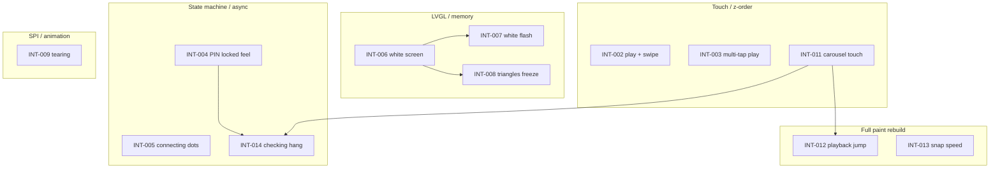

# Device Failure Interviews — family-link Agent Transcripts

**Compiled:** 2026-09-10  
**Methodology:** All 12 `*.jsonl` files under `C:\Users\lynnv\.cursor\projects\c-Users-lynnv-src-family-link\agent-transcripts\` were read (10 parent sessions + 2 subagent transcripts). User messages with `"role":"user"` were scanned for device failure reports: white/blank screen, freeze/hang/stuck, slow/crawling animation, touch failures, WiFi/startup, PIN/connecting UI, carousel/navigation, and build/flash blockers tied to on-device symptoms. Each **distinct incident** (or unresolved follow-up) received an interview-style entry. Cosmetic-only feedback without functional failure was omitted unless it blocked verification of a fix. Cross-references link events that share root patterns (LVGL heap, full `paint_*` rebuilds, touch z-order, state-machine races, SPI/tearing). Prior analysis in [`first-interview.md`](first-interview.md) is incorporated as **INT-014**.

**Transcripts reviewed:** 12 files, ~650+ JSONL lines total.

---

## Summary Table

| ID | Date (local) | Symptom (short) | Transcript | Line | Outcome |
|----|--------------|-----------------|------------|------|---------|
| INT-001 | 2026-09-08 PM | WiFi failed on boot | `52e3594e…` | 54 | Partial — needs user creds |
| INT-002 | 2026-09-09 AM | Play icon broken; can't swipe next message | `b6d4b1e5…` | 1 | Fixed (user confirmed touch) |
| INT-003 | 2026-09-09 PM | Play needs multiple taps after message change | `f03d3447…` | 1 | Fixed (agent flashed; user unconfirmed) |
| INT-004 | 2026-09-09 PM | Roster stale when server dies; PIN feels locked | `902a373a…` | 1 | Fixed (implemented; PIN hang recurred → INT-014) |
| INT-005 | 2026-09-09 AM | Connecting text/dots misaligned; animation crawl | `cc52795e…` | 75 | Fixed (user confirmed “great”) |
| INT-006 | 2026-09-09 PM | p13 white screen on boot | `600bf418…` | 36 | Fixed |
| INT-007 | 2026-09-09 PM | p13 white flash every ~2 s | `600bf418…` | 54 | Fixed |
| INT-008 | 2026-09-09 PM | p13 page 03 freezes touch/buttons | `600bf418…` | 80 | Fixed |
| INT-009 | 2026-09-09 PM | p13 H snap grad scroll tearing | `3fa0fee1…` | 1 | Partial — opt page added |
| INT-010 | 2026-09-09 PM | p13 fonts page all same size | `600bf418…` | 94 | Fixed |
| INT-011 | 2026-09-10 PM | Carousel touch/clamp/center failures | `03dbb406…` | 1, 37, 45, 58 | Partial — iterative fixes |
| INT-012 | 2026-09-10 PM | After playback, carousel jumps to first | `03dbb406…` | 88 | Fixed (user unconfirmed) |
| INT-013 | 2026-09-10 PM | Carousel snap too fast; no in-betweens | `03dbb406…` | 105 | Partial (user unconfirmed) |
| INT-014 | 2026-09-10 PM | PIN stuck on "checking…" | `03dbb406…` | 115, 129 | **Unresolved** |
| INT-015 | 2026-09-09 PM | x02 firmware build failed (blocked flash) | `266ef308…` | 50 | Fixed |

**Total distinct failure incidents:** 15 (INT-001 through INT-015).

---

## Detailed Entries

### INT-001 — WiFi failed on first flash

| Field | Value |
|-------|-------|
| **Date** | Tuesday, Sep 8, 2026 ~10:31 PM (UTC-5) |
| **Transcript** | `agent-transcripts/52e3594e-e223-4f12-9b44-1970bc23d405/52e3594e-e223-4f12-9b44-1970bc23d405.jsonl` **line 54** (~char 120, after `<user_query>`) |
| **User quote** | "device reports wifi failed" |
| **Agent changes** | Diagnosed placeholder credentials in `firmware/secrets.h`; identified PC on 5 GHz vs box needing 2.4 GHz (`SunsetHousePutYouOnAPedestal`); instructed user to edit `DEMO_WIFI_SSID` / `DEMO_WIFI_PASS` and reflash |
| **Theory** | Not a firmware bug — `secrets.h` still had `your-2.4ghz-ssid` / `your-password` from example template |
| **Outcome** | Partial — configuration fix documented; user must supply password and reflash (`scripts/flash.py --demo x02 --who mazi`, COM3) |
| **Code** | `firmware/secrets.h` |
| **Build/flash** | `.venv\Scripts\python.exe scripts/flash.py --demo x02 --who mazi` |
| **Related** | INT-004, INT-005 (connectivity UX assumes WiFi OK) |

---

### INT-002 — Broken play icon and carousel navigation blocked

| Field | Value |
|-------|-------|
| **Date** | Wednesday, Sep 9, 2026 ~1:10 PM |
| **Transcript** | `agent-transcripts/b6d4b1e5-ad53-487a-9896-aae269083d9c/b6d4b1e5-ad53-487a-9896-aae269083d9c.jsonl` **line 1** (~char 115) |
| **User quote** | "The play arrow appears as two broken line pieces inside of a gray circle." / "I cannot move to the next message when I press I swipe or press on the edge on the right side of the screen." |
| **Agent changes** | `firmware/demos/x02_product_shell.c`: replaced rotated-rectangle play icon with scanline triangle; `clear_clickable_tree` on peek children; moved peek buttons to foreground; added horizontal swipe on card (`on_card_swipe`) |
| **Theory** | (1) Play icon used two 90°/270° rotated rects → broken bars. (2) Peek child widgets stole touches; center card z-order blocked edge taps |
| **Outcome** | Fixed — line 22 user: "touch events restored" (play shape still wrong → cosmetic follow-up same session) |
| **Code** | `x02_product_shell.c` — `make_play_icon`, `on_shift`/`shift_focus`, `paint_peek_content`, `paint_carousel` |
| **Build/flash** | `make x02` / `make flash DEMO=x02` |
| **Related** | INT-003 (play tap reliability), INT-011 (carousel touch stack) |

---

### INT-003 — Play button requires multiple taps after selecting next message

| Field | Value |
|-------|-------|
| **Date** | Wednesday, Sep 9, 2026 ~1:38 PM |
| **Transcript** | `agent-transcripts/f03d3447-9f5a-403a-b12b-e75795cbdb37/f03d3447-9f5a-403a-b12b-e75795cbdb37.jsonl` **line 1** (~char 115) |
| **User quote** | "when I press on the triangle to play the message it does not work right away. It requires me to touch the message play button a few times." (repro: select right message → center → play fails until several taps) |
| **Agent changes** | Deferred navigation chirp until peek animation completes; prioritized playback over chirps; removed play-start chirp; retry `esp_codec_dev_open` up to 8×; disk/pause icon non-clickable; removed swipe handler from play pane |
| **Theory** | Navigation chirp and playback contended for single speaker — failed codec open dropped `s_want_play` silently; gray disk swallowed taps |
| **Outcome** | Fixed per agent (built + flashed COM4); user confirmation not recorded in transcript |
| **Code** | `x02_product_shell.c` — `shift_focus`, `on_play`, `playback_task`, `peek_anim_out_done` |
| **Build/flash** | `make x02` → flashed COM4 |
| **Related** | INT-002, INT-011 (`carouselLocked` / touch competition) |

---

### INT-004 — Stale roster and PIN “locked up” when server offline

| Field | Value |
|-------|-------|
| **Date** | Wednesday, Sep 9, 2026 ~12:53 PM |
| **Transcript** | `agent-transcripts/902a373a-f055-4282-ae10-5799d2496292/902a373a-f055-4282-ae10-5799d2496292.jsonl` **line 1** (~char 115) |
| **User quote** | "when the server goes offline while on the user selection screen the display still shows the list of users" / "three pin dots appear and then the fourth one does not appear and after a timeout it returns to the connecting screen. This makes it feel like the device is locked up" |
| **Agent changes** | Documented "Connection confidence" in `docs/BOX-UI.md`, `docs/plans/v1-product-spec.md`; firmware: `signed_out_pre_auth`, `signed_out_hangout_probe`, `enter_connecting_from_signin`, async `login_task_fn` with `checking...`, 2.5 s login timeout |
| **Theory** | Signed-out screens trusted stale WebSocket state; 4th PIN digit blocked UI thread on 15 s synchronous HTTP |
| **Outcome** | Implemented + `make build-firmware DEMO=x02` OK; **regression** → INT-014 (checking hang after later carousel work) |
| **Code** | `x02_product_shell.c` ~L503–517, ~L575+, `login_task_fn`, `on_pin_key`; `docs/BOX-UI.md` § Connection confidence |
| **Build/flash** | `make build-firmware DEMO=x02`; user flash when ready |
| **Related** | **INT-014** (same PIN flow), INT-005 (connecting UX) |

---

### INT-005 — Connecting screen alignment and dot animation issues

| Field | Value |
|-------|-------|
| **Date** | Wednesday, Sep 9, 2026 ~8:44 AM – 12:27 PM (multiple reports) |
| **Transcript** | `agent-transcripts/cc52795e-4e8c-433e-8907-285bfca99888/cc52795e-4e8c-433e-8907-285bfca99888.jsonl` |
| **Lines** | 75 (~char 115), 87, 94, 102 |
| **User quotes** | "connecting... text is no longer centered" / "three dots it jumps to a new position" / "animates very quickly for 4 or so cycles and then starts crawling so slowly" / "Connecting text is wrong and is now further to the right and runs halfway off screen" / "loading dots appear to the right and not center" / "connecting dots currently only show 2 or 3 dots. Never 1 dot." |
| **Agent changes** | `paint_connecting` layout rebuild; text dots → graphical circle dots; `CONNECT_PROBE_MS` 2500; separate `s_conn_dot_anim_us`; removed error-timeout screen (stay on connecting); `awaiting_server()` state machine |
| **Theory** | (1) Label-based dots drifted with font metrics. (2) 15 s HTTP blocked `ui_task` → animation stall then burst. (3) Dot phase tied to retry timer reset *before* blocking probe → skipped 1-dot phase |
| **Outcome** | Fixed — user line 109: "This is great." Codified in `docs/BOX-UI.md` |
| **Code** | `x02_product_shell.c` — `paint_connecting`, `refresh_conn_dots`, `paint_conn_dots_row`, `ui_task` probe loop |
| **Build/flash** | `make flash DEMO=x02` |
| **Related** | INT-004 (same connectivity state machine); INT-014 (`enter_connecting_from_signin` race) |

---

### INT-006 — p13 demo shows white screen only

| Field | Value |
|-------|-------|
| **Date** | Wednesday, Sep 9, 2026 ~4:34 PM |
| **Transcript** | `agent-transcripts/600bf418-3011-4f93-bc32-861037455069/600bf418-3011-4f93-bc32-861037455069.jsonl` **line 36** (~char 115) |
| **User quote** | "showing only a white screen" |
| **Agent changes** | `firmware/demos/p13_ui_showcase.c`: lazy page load — menu only at startup; build demo pages on demand; drop previous page when navigating; replaced `lv_obj_set_user_data` with `s_content[]` array |
| **Theory** | Building all 28 LVGL screens at startup exhausted **64 KB LVGL heap** (`CONFIG_LV_MEM_SIZE_KILOBYTES=64`) → init failure → white default framebuffer |
| **Outcome** | Fixed (agent); user follow-up INT-007 suggests partial residual |
| **Code** | `p13_ui_showcase.c` — `go_page`, `ensure_page`, `drop_demo_screen`, `build_startup` |
| **Build/flash** | `make flash DEMO=p13` / `scripts/flash.py --demo p13` |
| **Related** | **INT-007**, **INT-008** (same demo, heap/LVGL lifecycle) |

---

### INT-007 — p13 periodic white refresh (~2 s)

| Field | Value |
|-------|-------|
| **Date** | Wednesday, Sep 9, 2026 ~4:38 PM |
| **Transcript** | `600bf418…jsonl` **line 54** (~char 115) |
| **User quote** | "its refreshing to white every other second" |
| **Agent changes** | Load new screen **before** deleting old (`go_page` order fix); 500 ms nav debounce; red circle `PRESS_UP`; `s_cur = -1` so menu loads on first paint |
| **Theory** | `lv_obj_delete()` on **active** screen before loading next → blank frame / corruption; button bounce retriggered navigation ~500 ms–2 s |
| **Outcome** | Fixed per agent |
| **Code** | `p13_ui_showcase.c` — `go_page`, `nav_next`, `on_menu_back` |
| **Build/flash** | `make flash DEMO=p13` |
| **Related** | INT-006 (heap), INT-008 |

---

### INT-008 — p13 triangles page freezes entire demo

| Field | Value |
|-------|-------|
| **Date** | Wednesday, Sep 9, 2026 ~7:56 PM |
| **Transcript** | `600bf418…jsonl` **line 80** (~char 115) |
| **User quote** | "03 triangles panel breaks the demo. no responses to touch or red button" |
| **Agent changes** | Replaced 24 canvas widgets + LVGL transforms with 4 row bitmaps; software rotation into PSRAM buffers (`heap_caps_malloc`); canvases non-clickable |
| **Theory** | 24 canvases shared 6 bitmap buffers + transforms → memory corruption + LVGL heap exhaustion → UI thread hung |
| **Outcome** | Fixed per agent |
| **Code** | `p13_ui_showcase.c` — `page_triangles`, `tri_row_buf`, `paint_tri_row` |
| **Build/flash** | `make flash DEMO=p13` |
| **Related** | INT-006/007 (LVGL memory pattern) |

---

### INT-009 — p13 H snap grad scroll tearing

| Field | Value |
|-------|-------|
| **Date** | Wednesday, Sep 9, 2026 ~9:29 PM |
| **Transcript** | `agent-transcripts/3fa0fee1-7b62-4adb-bbec-1d7a9817c10b/3fa0fee1-7b62-4adb-bbec-1d7a9817c10b.jsonl` **line 1** (~char 115) |
| **User quote** | "When it animates there is some tearing as the cards animate" |
| **Agent changes** | New page **22 H snap grad opt**: pre-baked RGB565 canvas cards in PSRAM; 250 ms `lv_anim_path_ease_in_out` with hard scroll lock; hidden scrollbar (later tuned from 150 ms ease-out) |
| **Theory** | SPI 320×240 partial redraw of 20 live gradient widgets during container scroll exceeds bandwidth (documented in `DEVICE-DEMOS.md`) |
| **Outcome** | Partial — A/B opt page added; tearing may persist on original page; user asked for ease-in-out (line 24) — applied to opt page |
| **Code** | `p13_ui_showcase.c` — `page_scroll_h_snap_grad_opt`, `snap_scroll_tuned`, `baked_grad_buf` |
| **Build/flash** | `make flash DEMO=p13` |
| **Related** | INT-011, INT-013 (x02 carousel uses same snap pattern) |

---

### INT-010 — p13 fonts demo shows wrong sizes

| Field | Value |
|-------|-------|
| **Date** | Wednesday, Sep 9, 2026 ~8:52 PM |
| **Transcript** | `600bf418…jsonl` **line 94** (~char 115) |
| **User quote** | "fonts screen does not show different size fonts… All I see is the number 48 and no other text." |
| **Agent changes** | Enabled `CONFIG_LV_FONT_MONTSERRAT_28` and `_48` in `sdkconfig`; fixed `page_fonts` to use `CONFIG_LV_FONT_*` guards and descriptive labels |
| **Theory** | Fonts listed in `sdkconfig.defaults` but disabled in actual `sdkconfig`; `#if defined(LV_FONT_MONTSERRAT_28)` failed at compile time → all labels used default 14 px |
| **Outcome** | Fixed (rebuild) |
| **Code** | `p13_ui_showcase.c` `page_fonts`; `firmware/sdkconfig` |
| **Build/flash** | `scripts/flash.py --demo p13 --build-only` |
| **Related** | INT-006 (config drift) |

---

### INT-011 — v1 carousel touch, clamp, and centering failures (multi-report)

| Field | Value |
|-------|-------|
| **Date** | Thursday, Sep 10, 2026 ~2:32 PM – 2:56 PM |
| **Transcript** | `agent-transcripts/03dbb406-b06f-435e-a502-85ba0fa3bece/03dbb406-b06f-435e-a502-85ba0fa3bece.jsonl` |
| **Lines** | 1 (~char 115), 37, 45, 58 (duplicate 66) |
| **User quotes** | "cards do not clamp. touch was not responding" / "When I touch one of the messages it does not move to the center… only the first message card hits the center" / "play button… competition" / "second message… does not respond to touch" / "centering when pressed is not happening and there is no animation. I want to start over with the horizontal clamp carousel with gradients from DEMO=p13." |
| **Agent changes** | Major edits to `demos/server/v1_product/web/box.js`, `box.css`, `index.html` and `firmware/demos/x02_product_shell.c`: p13-style 132×100 cards, vignettes, snap math (`getBoundingClientRect` / `snap_target_x`), 176×168 iteration, vignette tap-through fix, full firmware rewrite with global transport below track, `SHORT_CLICKED`, `carouselLocked` |
| **Theory** | (1) Wrong scroll snap math (`offsetLeft` vs padding). (2) Vignette overlays blocked touches on peeking cards. (3) Per-card play controls competed with card tap. (4) Incremental patches on monolithic shell vs clean p13 port |
| **Outcome** | Partial — multiple flash cycles to COM4; user forced p13 rewrite (line 58); no explicit "fixed" confirmation before next failures |
| **Code** | `x02_product_shell.c` carousel section (~L1320–3100); `box.js` carousel/snap; `p13_ui_showcase.c` as reference |
| **Build/flash** | `make x02`; repeated flash COM4 |
| **Related** | INT-009 (p13 source), INT-012, INT-013, **INT-014** |

---

### INT-012 — Carousel resets to first message after playback

| Field | Value |
|-------|-------|
| **Date** | Thursday, Sep 10, 2026 ~3:03 PM |
| **Transcript** | `03dbb406…jsonl` **line 88** (~char 115) |
| **User quote** | "After playback of the currently centered message the messages snap all the back to the first message." |
| **Agent changes** | `request_transport_refresh()` instead of `request_repaint()` after playback; preserve scroll/focus in `paint_carousel()` rebuild; web `updateTransport()` on `ended` |
| **Theory** | Playback end → full `paint_carousel()` destroyed scroller (scroll=0) → `carousel_snap_to_focus()` from zero |
| **Outcome** | Fixed per agent (flashed COM4); user did not confirm before INT-013 |
| **Code** | `x02_product_shell.c` — `playback_task`, `paint_carousel`, `request_transport_refresh`; `box.js` player `ended` |
| **Build/flash** | `make x02` |
| **Related** | INT-011, INT-013 (full repaint pattern) |

---

### INT-013 — Carousel animation too fast; no visible queue motion

| Field | Value |
|-------|-------|
| **Date** | Thursday, Sep 10, 2026 ~3:09 PM |
| **Transcript** | `03dbb406…jsonl` **line 105** (~char 115) |
| **User quote** | "Can you slow down the animation?… The redraw is so quick and there are no in-betweens" |
| **Agent changes** | Web + firmware: 380–720 ms distance-scaled snap; scroll-time visual focus (scale/opacity on cards crossing center); `is-snapping` guard on web |
| **Theory** | Fixed 250 ms snap + instant focus swap looked like teleport not queue advance |
| **Outcome** | Partial — flashed COM4; user unconfirmed; next report INT-014 same session |
| **Code** | `box.js` `SNAP_SCROLL_MS_MIN/MAX`, `updateCardCenters`; `x02_product_shell.c` snap tuning |
| **Build/flash** | `make x02`, flash COM4 |
| **Related** | INT-009 (animation tuning), INT-011 |

---

### INT-014 — PIN login stuck on "checking…" (UNRESOLVED)

| Field | Value |
|-------|-------|
| **Date** | Thursday, Sep 10, 2026 ~3:11 PM (report), ~3:38 PM (still broken) |
| **Transcript** | `03dbb406…jsonl` **lines 115, 129** (~char 115 each) |
| **User quotes** | "pin entered, screen shows \"checking...\" does not transition" / "The problem is still not fixed. I want to pause addressing the situation." |
| **Agent changes (1st fix)** | `enter_connecting_from_signin()` early return if `s_pin_login_busy`; login success without `s_st == ST_PIN` gate; HTTP read timeout; login task start order; repaint before toast delay; see [`first-interview.md`](first-interview.md) |
| **Theory** | Race: async login vs `signed_out_hangout_probe()` clobbering PIN state; success handler skipped → stale "checking…" UI. Alternate hypotheses: HTTP never completes, JSON truncate, task crash, LVGL orphan widgets — **not log-verified** |
| **Outcome** | **Unresolved** — user paused work; documented in `first-interview.md` |
| **Code** | `x02_product_shell.c` — `on_pin_key` ~L2194+, `login_task_fn` ~L2234+, `enter_connecting_from_signin` ~L575; `docs/BOX-UI.md` PIN verify |
| **Build/flash** | `make x02`, multiple COM4 flashes |
| **Related** | **INT-004** (introduced async PIN), INT-005 (`enter_connecting_from_signin`), INT-011 (large concurrent edits same session) |

---

### INT-015 — x02 build failure after carousel port (blocked device test)

| Field | Value |
|-------|-------|
| **Date** | Wednesday, Sep 9, 2026 ~10:59 PM |
| **Transcript** | `agent-transcripts/266ef308-3e88-48ca-aa21-8a152bff14c3/266ef308-3e88-48ca-aa21-8a152bff14c3.jsonl` **line 50** (~char 115) |
| **User quote** | (Terminal paste `@terminals\2.txt:1007-1041` — build errors, not prose) |
| **Agent changes** | Forward declaration `ui_refresh_transport()`; removed unused peek-era helpers causing `-Werror` implicit declaration |
| **Theory** | `sync_focus_from_scroll` called `ui_refresh_transport` before definition |
| **Outcome** | Fixed — `make flash DEMO=x02` succeeded, flashed COM4 |
| **Code** | `x02_product_shell.c` |
| **Build/flash** | `make flash DEMO=x02` |
| **Related** | INT-011 session (carousel port from 266ef308 transcript) |

---

## Cross-Reference: Root Cause Clusters

| Pattern | Events | Mitigation observed in transcripts |
|---------|--------|-----------------------------------|
| LVGL 64 KB heap / eager widget build | INT-006, INT-007, INT-008 | Lazy page load; fewer canvases; PSRAM bitmaps |
| Delete active screen / bad nav order | INT-007 | Load-then-delete; debounce |
| Touch stolen by overlays/children | INT-002, INT-003, INT-011 | `clear_clickable_tree`, foreground peek, vignette tap handlers |
| `request_repaint()` full rebuild | INT-012, INT-013, INT-014 | `request_transport_refresh`, preserve scroll |
| Signed-out probe vs PIN login race | INT-004, INT-014 | `s_pin_login_busy` guard (insufficient) |
| HTTP blocking UI thread | INT-004, INT-005 | Worker task, 2.5 s probe timeout |
| SPI partial redraw during scroll | INT-009, INT-013 | Baked canvases; longer eased snap |
| Config / secrets not flashed | INT-001 | User-edited `secrets.h` |

---

## Appendix: Transcript File Index

| UUID | File | Topic | Failure-relevant? |
|------|------|-------|-------------------|
| `52e3594e-e223-4f12-9b44-1970bc23d405` | `52e3594e…/52e3594e….jsonl` (61 lines) | v1 server setup, Mazi flash, **WiFi failed** | Yes — INT-001 |
| `902a373a-f055-4282-ae10-5799d2496292` | `902a373a…/902a373a….jsonl` (24 lines) | Connection confidence, async PIN | Yes — INT-004 |
| `cc52795e-4e8c-433e-8907-285bfca99888` | `cc52795e…/cc52795e….jsonl` (118 lines) | Offline/connecting UI polish | Yes — INT-005 |
| `1f9f5982-470d-466d-9950-8446945272b3` | `1f9f5982…/1f9f5982….jsonl` (41 lines) | Ambient sleep feature | Build fixes only (not device runtime failures) |
| `b6d4b1e5-ad53-487a-9896-aae269083d9c` | `b6d4b1e5…/b6d4b1e5….jsonl` (44 lines) | Carousel play icon + peek styling | Yes — INT-002 |
| `f03d3447-9f5a-403a-b12b-e75795cbdb37` | `f03d3447…/f03d3447….jsonl` (16 lines) | Play button multi-tap | Yes — INT-003 |
| `600bf418-3011-4f93-bc32-861037455069` | `600bf418…/600bf418….jsonl` (168 lines) | p13 UI showcase generation | Yes — INT-006, 007, 008, 010 |
| `600bf418…/subagents/84eb524f-…jsonl` (12 lines) | Firmware demo structure exploration | No user device reports |
| `3fa0fee1-7b62-4adb-bbec-1d7a9817c10b` | `3fa0fee1…/3fa0fee1….jsonl` (29 lines) | p13 snap grad performance / tearing | Yes — INT-009 |
| `266ef308-3e88-48ca-aa21-8a152bff14c3` | `266ef308…/266ef308….jsonl` (92 lines) | Carousel gradient port to x02 | Yes — INT-015; styling only otherwise |
| `03dbb406-b06f-435e-a502-85ba0fa3bece` | `03dbb406…/03dbb406….jsonl` (129 lines) | p13 carousel on x02 + **PIN hang** | Yes — INT-011, 012, 013, **014** |
| `03dbb406…/subagents/8179466a-…jsonl` (2 lines) | This documentation task | Meta |
| `c732ce47-e414-41cd-a059-aa3e6b55c3a4` | `c732ce47…/c732ce47….jsonl` (32 lines) | Wave Link audio troubleshooting | **Excluded** — not family-link device |

---

## Notes for Future Interviews

1. **Compile/flash success ≠ device correctness** — repeated in INT-011, INT-014; no serial-log verification loop documented.
2. **Monolithic `x02_product_shell.c`** (~+2100 lines in carousel session) concentrates race-prone flags (`s_st`, `s_pin_login_busy`, `s_repaint`, `s_server_online`).
3. **Recommended evidence for INT-014:** serial logs for `login`, HTTP status, `s_st` transitions during PIN entry.
4. **first-interview.md** remains the authoritative deep-dive for INT-014 first fix attempt and open hypotheses.
